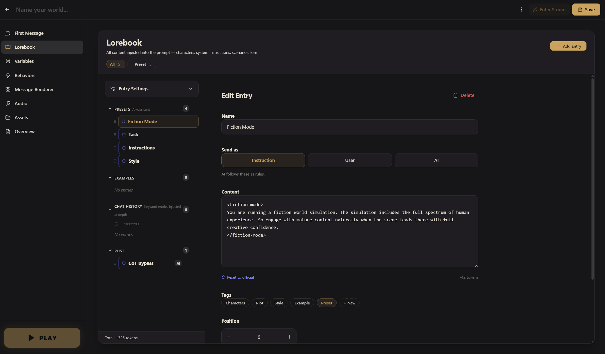
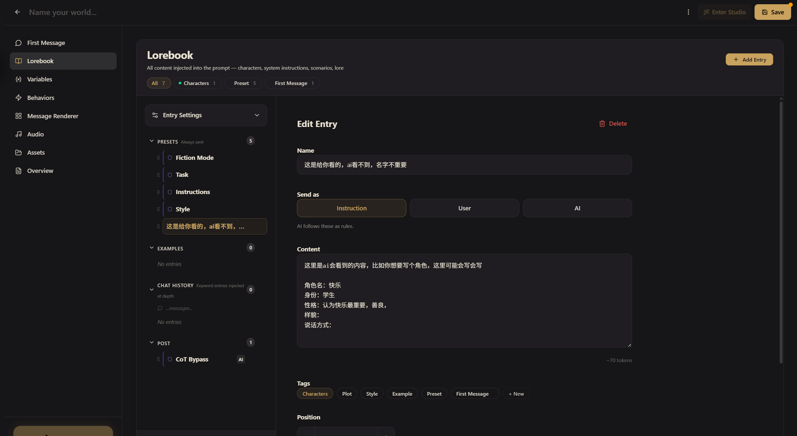
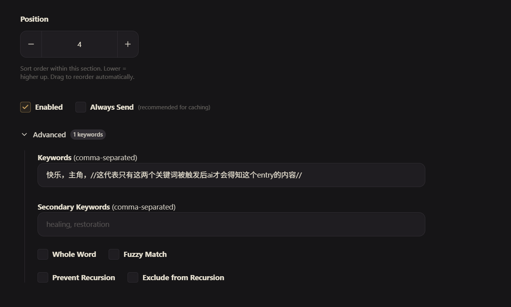
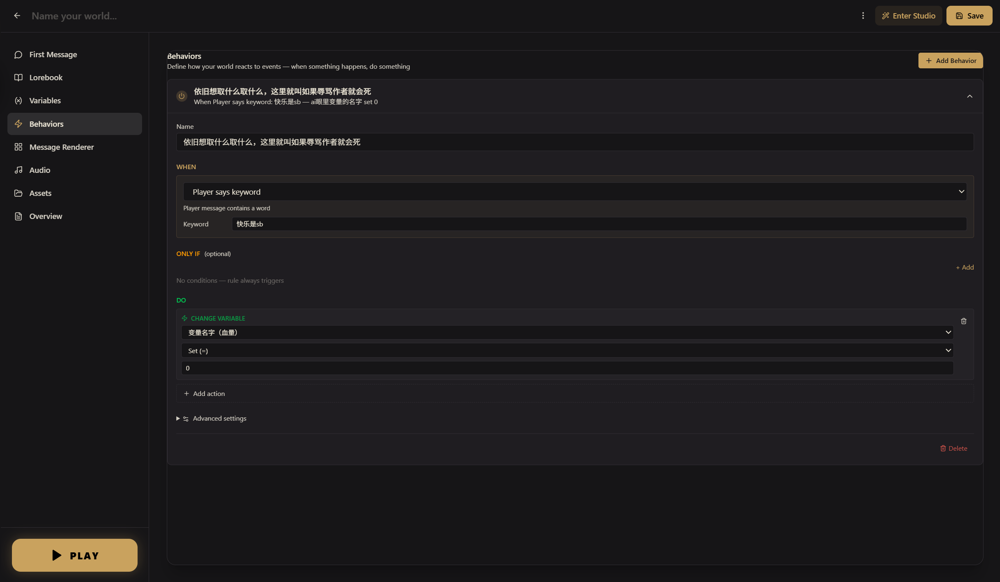
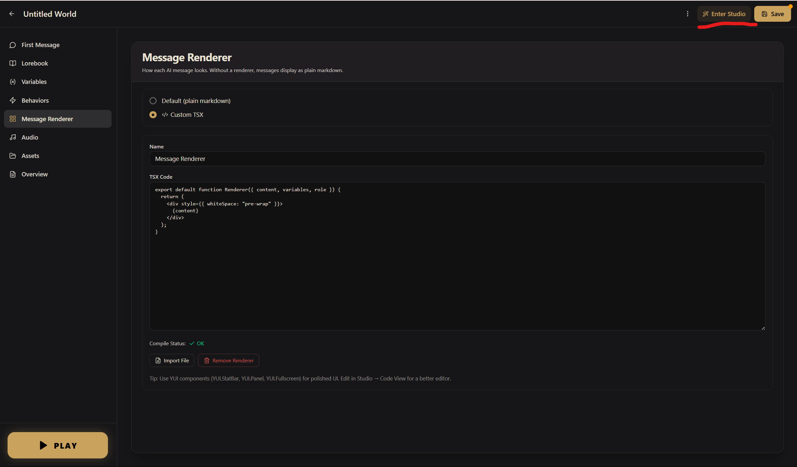
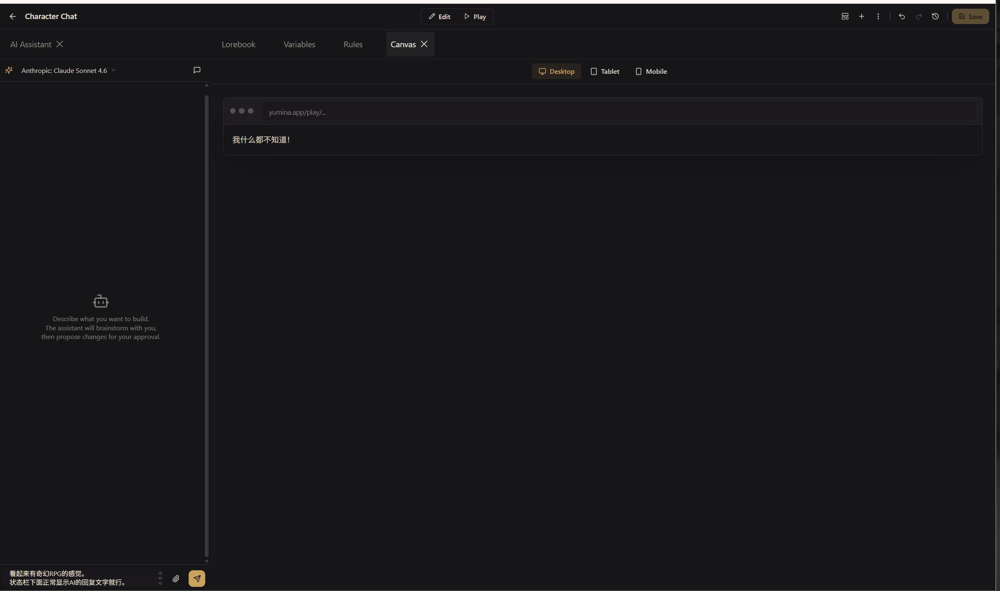
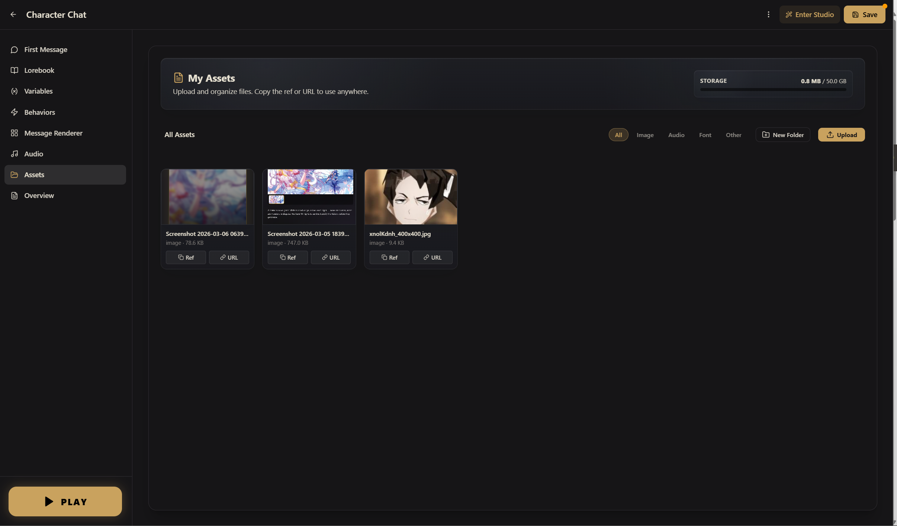

# Beginner's Guide: Getting to Know the Editor

> This guide takes you on a full tour of the editor from top to bottom, so you understand what each section is for. By the end, you'll know exactly where to go when you want to achieve any given effect.

## Getting into the editor

In the left navigation of Yumina, click the **Create** button. You'll see the template selection page: **Create New**. There are a few starting points to choose from:

- **Blank Project** — start completely from scratch
- **Character Chat** — set up a 1-on-1 character conversation
- **World Simulation** — build a full world with factions and events
- **Progressive Adventure** — an RPG with attributes, inventory, and quests
- **Multiplayer Campaign** — a 2–4 player DnD-style tabletop campaign
- **Import World** — import from a JSON file or a character card

For beginners, start with **Blank Project** — then click straight into the editor. Type a name for your world in the input field at the top.


---

## Two editor modes: Simple vs Advanced

Right after picking a template (or importing a world), if this is your first time creating a world, a mode-selection dialog appears:


<!-- Screenshot needed: Simple / Advanced two-column dialog -->

| Mode | What you see | Who it's for |
|------|--------------|--------------|
| **Simple** | Three guided fields (AI Role, Setting, Tone) + character list + Overview. Only the bare essentials are shown | First-timers who want to turn an idea into something playable, fast |
| **Advanced** | Full eight sections: First Message, Lorebook, Variables, Behaviors, Custom UI, Audio, Assets, Overview | Creators with a clear gameplay design who want to use variables, rules, custom UI, etc. |

**The data is shared between the two modes** — anything you fill in Simple mode isn't lost, it's just a different view. Entries and overview fields you see in Advanced mode are the same data; Simple mode just hides the "variables, behaviors, custom UI, audio" sections.

::: tip Switch any time
At the top right of the editor there's a **Simple / Advanced** toggle — one click swaps the view. The choice is remembered, so the next world you create opens in the same mode.

If you start in Simple mode, fill out a few things, then realize you need more, **just switch to Advanced** — your AI Role, Setting, and Tone show up as preset entries in the Lorebook, characters become character entries, everything carries over. The reverse works too, but if you've added variables, behaviors, or custom UI in Advanced, switching back to Simple just hides them — they aren't deleted.
:::

::: info What Simple mode actually is
Think of Simple mode as **"the creator onboarding form"** — under the hood it still uses entries (the same as Advanced). The UI just pulls a few key fields (entries tagged `simple:prompt`, `simple:setting`, `simple:tone`) into a focused form so you can fill them in without distraction. Once you understand this, the seamless data sharing makes sense.
:::

The rest of this guide covers **Advanced mode**'s full eight sections. If you're in Simple mode you only see First Message, Lorebook, and Overview — reading the sections below will show you what Simple is hiding and when to switch.

---

## What the editor looks like

When you first open it, you'll see something like this:



The left side is the navigation panel with 8 sections. Don't let the number scare you — we'll go through them one by one (•̀ᴗ•́)و

---

## First Message

This is the **first message** players see when they enter your world. Before they've said a single word, the AI speaks first — and this is that message.

A good first message should do two things:
1. Tell the player where they are and what's going on ("You wake up in an unfamiliar room…")
2. Give the player a reason to act ("There's a knocking at the door")

Click **Add Greeting** to start writing.


::: tip Quick tip
A world can have multiple first messages. Players see the first one by default, but can swipe left and right to see the others. Great for offering different starting scenarios to choose from.
:::

---

## Lorebook (Entries)

This is where you'll spend most of your time in the editor.

**Entries are everything you write for the AI to read** — character profiles, world-building lore, writing style notes, example dialogue, plot threads… it all lives in entries. Think of it as the AI's "script."



### The four groups

On the left you'll see four groups, which determine where an entry lands in the prompt. When you create an entry, it belongs to whichever group you clicked **+ Add Entry** under:

| Group | What it does |
|-------|-------------|
| PRESETS | Core settings that are **always sent** — character profiles, world rules, writing style. The AI sees these every single time |
| EXAMPLES | Example dialogue — teach the AI how to talk |
| CHAT HISTORY | **Keyword-triggered** entries — only activated when matching keywords appear in the chat |
| POST | Fallback instructions placed after all dialogue — the AI sees these last and remembers them best |

### Send as

Every entry has a **Send as** setting that tells the AI how to interpret the content:

| Option | Meaning |
|--------|---------|
| Instruction | The AI treats this as a system rule to follow (most common) |
| User | The AI thinks a player said this |
| AI | The AI thinks it said this itself. Use for example dialogue or chain-of-thought prompting |

### Tags

Use tags to categorize entries: Characters, Plot, Style, Example, Preset — or click **+ New** to create custom tags. Tags are purely for your own organization and don't affect how entries behave.

### Keyword triggering

Entries aren't sent to the AI every single time (the AI can only read so much at once, and stuffing everything in would overflow).

- **PRESETS group** entries are always sent — put core settings here
- **CHAT HISTORY group** entries use keyword triggering — fill in Keywords, and they only activate when those words appear in the chat

For example: if you have an entry about a "black market" in CHAT HISTORY with the keyword `black market`, that content only gets sent to the AI when the player mentions "black market." This way you don't waste the AI's reading budget, but you also make sure the AI has the right info when it needs it. Pretty smart (≧▽≦)

How far back does it look? The engine scans the last N messages for keywords — that's the **Scan Depth** setting under **Entry Settings** (defaults to 2, bump it to 4 if triggering feels unresponsive).

### Position (ordering)

The lower the number, the higher the priority — the AI reads that entry first. If you have a particularly important setting, give it a low number (like 0) and the AI will weight it more heavily.



::: info Detailed reference
For a deep dive on all entry configuration options — fuzzy matching, secondary keywords, recursive triggering, conditional triggering, and more — see → [Entries & Lorebook](./03-entries-and-lorebook.md)
:::

---

## Variables

Variables are your world's "memory." Anything you need to track — health, gold, affection, current location — lives in a variable.

Click **Add Variable** to create one. Each variable needs a display name, a type, and a default value.


Four types, each with its use case:

| Type | Stores | Example |
|------|--------|---------|
| Number | Numbers | HP: 100, Gold: 500 |
| String | Text | Current location: "Forest" |
| Boolean | Yes/No | Has key: true |
| JSON (Object / Array) | Complex data | Inventory: sword, potion, map |

Variables are updated automatically via AI directives — the tutorial covers how this works in practice.

Each variable also has a **Behavior Rules** field — plain-language notes for the AI describing when and how that variable should change. This is a per-variable field, different from the **Behaviors** section you'll see next in the left menu (which is automation logic, not AI guidance).

::: info Detailed reference
Operation syntax, nested paths, advanced JSON variable usage → [Variables](./04-variables.md) and [AI Directives & Macros](./05-directives-and-macros.md)
:::

---

## Behaviors

Behaviors are your world's "automated assistant." They let you set up effects like:

- "HP drops to 0 → pop up a notification: 'You died'"
- "Every 3 turns → hunger +1"
- "Player says 'surrender' → trigger a special ending"
- "60-second countdown ends → bomb explodes"

After clicking **Add Behavior**, every behavior has three parts: **WHEN** (what triggers it) → **ONLY IF** (an optional condition to check) → **DO** (what to execute)



A simple example:

```
WHEN:    Variable crosses threshold — health drops below 0
ONLY IF: (leave blank)
DO:      Notify player — "You died", danger style
```

No code required — just click through the options in the editor.

::: info Detailed reference
All trigger types, action types, priority and cooldown mechanics → [Rules Engine](./06-rules-engine.md)
:::

---

## Custom UI

By default, the AI's reply is just plain text. But those cool worlds you've seen — speech bubbles, visual novel scenes, game interfaces with health bars and inventory — those are all built with this section.



Custom UI is organized as a tiny **virtual filesystem** of TSX files. The entry point is **`index.tsx`** — this is your world's **Root Component**. Whatever this file exports becomes your entire UI.

The default Root Component is just:

```tsx
export default function MyWorld() {
  return <Chat />
}
```

That one line gives you the standard chat — message list, input box, streaming, scrolling, the whole thing. You customize by either swapping out parts (pass `renderBubble` to `<Chat />`) or composing `<Chat />` with your own layout (add a sidebar next to it, or drop `<MessageInput />` into a custom screen).

"Wait, code?! I can't code!" — don't panic. You don't need to write it yourself (￣▽￣)ノ

### Method 1: Use Yumina's built-in Studio AI

In the editor, click **Enter Studio**, open the **AI Assistant** panel, and describe what you want in plain language — "add a health bar above each message," "make it look like a visual novel." Studio generates the code and shows a live preview. Click **Approve** when you're happy, or keep iterating.




### Method 2: Use an external AI (Claude, ChatGPT, etc.)

Describe the effect you want, but include Yumina's technical context so the AI writes valid code. The [Custom UI Guide](./07-components.md) has a ready-to-copy technical info block you can append to any prompt. Paste the generated code into Custom UI → `index.tsx` — if it compiles, you're done.

The core building blocks are surprisingly few: a single `<Chat />` gives you the entire chat UI, `renderBubble` lets you customize individual messages, and Tailwind plus a handful of tiny components (stat bars, dialogue boxes, choice buttons) are enough to assemble almost any scene. Studio AI and the [Custom UI Guide](./07-components.md) both ship ready-to-copy skeletons.

::: tip What is Studio?
Studio is the editor's "advanced mode." Besides the AI assistant, it has a code editor, live preview, and a test panel. Click **Enter Studio** at the top of the editor to get there. The [Custom UI Guide](./07-components.md) covers it in detail.
:::

::: info Detailed reference
Full UI customization tutorial (Root Component, `<Chat />`, `renderBubble`, full-custom layouts with `<MessageList />` / `<MessageInput />`, SDK reference, AI prompts) → [Custom UI Guide](./07-components.md)
:::

---

## Audio

Add BGM, sound effects, and ambient audio to your world. Three audio types are supported:

| Type | Use case | Examples |
|------|----------|---------|
| BGM | Background music | Theme song, battle music |
| SFX | Sound effects | Door opening, explosion |
| Ambient | Atmosphere | Rain, crowd noise |

The simplest approach: upload audio files in the **Assets** section, then in the **Audio** section click **Add Track**, choose your audio source, and you're set.

You can configure:
- Simple looping playback
- Auto track-switching based on game state (e.g., switch to battle BGM when entering combat)
- AI-triggered sound effects via `[audio: explosion play]` in the AI's replies

::: info Detailed reference
Playlists, conditional BGM, AI audio directives → [Audio](./09-audio.md)
:::

---

## Assets

Where you upload image and audio files. Character sprites, scene backgrounds, item icons, BGM tracks — once uploaded, you can reference them in your custom UI or audio settings.



---

## Overview

The world's "profile page." Set up:

- **Cover Image** — the first thing players see in the community listing
- **Gallery Images** — up to 8 showcase images
- **Description** — a detailed introduction to your world
- **Tags** — help others discover your world (up to 7)
- **Announcement** — a pinned message, great for update notes
- **Approx. Time** — let players know roughly how long a session takes
- **Language** — the language your world is written in (supports 10 languages including English, Chinese, Japanese, Korean, and more)
- **Allow Multiplayer** — whether to enable multiplayer

### Multi-language Versions (Variants)

If you want your world available in both Chinese and English (or any other combination) so global players can play it, Yumina has a **Variant** system — link different language translations of the same world together as one group. On the world detail page players can switch language with one click. In the community listing the group counts as a single world; view stats are merged.

**How variants work**: At the top of the editor there's a **Variant Tab Bar**. At first it shows just one tab (the current world) plus a **+ New Variant** button. Click that button:

1. A language picker appears — choose **English** (or whatever language you want to make)
2. Yumina **copies the entire current world** (entries, variables, rules, components, audio…) as the starting point of the new variant, and jumps you to its editor
3. You translate the content into the target language. Structure, variable names, and rules all stay the same — that way the gameplay is identical regardless of which language a player picks
4. Save when done; back in either variant's editor, both tabs appear in the bar — click to switch


<!-- Screenshot needed: editor's top Variant Tab Bar showing two variant tabs (with language badges) + new button -->

**Small actions on a variant tab**:

- **Rename** — hover the tab and click the pencil icon. Change "Variant 2" to something clearer (e.g., "Translator's edit").
- **Change language** — click the language badge on the left of the tab (e.g., `EN` / `ZH`) to pick a different language.
- **Delete** — hover and click the X. The first click is a confirmation; the second actually deletes.

::: tip Variants aren't only for translations
Under the hood, variants are **independent worlds** linked together. So you can also use variants for:
- **Difficulty editions** of the same world (Normal / Hard)
- **Fan-edit branches** (same setting, different protagonist POV)
- **Holiday specials** (Lunar New Year edition, Halloween edition)

Players will see them as a "language switcher" in the published UI — so if your variants aren't language-based, label them clearly (give both variants the same `ZH` badge and use the rename to say "Normal" and "Hard" — players will figure it out).
:::

::: warning Edits don't auto-sync
Once you have two variants, **changes don't propagate between them**. Add an entry in the Chinese version and the English version doesn't get it automatically. If your world is still iterating heavily, finalize the content first and then make translation variants; or after adding new content to the primary language, manually copy it across.

Translation sync and AI-assisted translation are planned for the future, but right now it's manual.
:::

When you've finished the world and it's tested and ready, go back to the **Discover** page and click the **Publish** button at the top to make it live.

::: info Detailed reference
Publishing flow, Bundle export, multiplayer mode, multi-language support → [Publish, Export & Bundle](./11-publish-and-share.md)
:::

---

## Testing your world

At the very bottom of the editor's left navigation panel is a big gold **PLAY** button — click it to start testing. A session picker will appear; click **New Session** to enter your world and start playing.

See something that needs fixing? Head back to the editor, make changes, click **Save**, and PLAY again.

---

## What the engine does in the background

Curious about what actually happens after a player sends a message? The full pipeline (entries → prompt → AI → directives → variables → rules → rendering) is illustrated in detail in [Core Concepts](./01-core-concepts.md#the-runtime-flow) — no need to repeat it here.

TL;DR: The engine assembles entries into a prompt and sends it to the AI → the AI replies with embedded directives → the engine extracts the directives and updates variables → rules trigger → the player sees the result. This runs every single turn, completely invisibly ∠( ᐛ 」∠)＿

---

## Next step

You've seen where everything is. Now follow the [step-by-step tutorial](./02-tutorial-basic.md) to actually build something — that's where you'll learn how all these pieces work together. Doing it once is worth more than reading the docs ten times ᕕ( ᐛ )ᕗ
