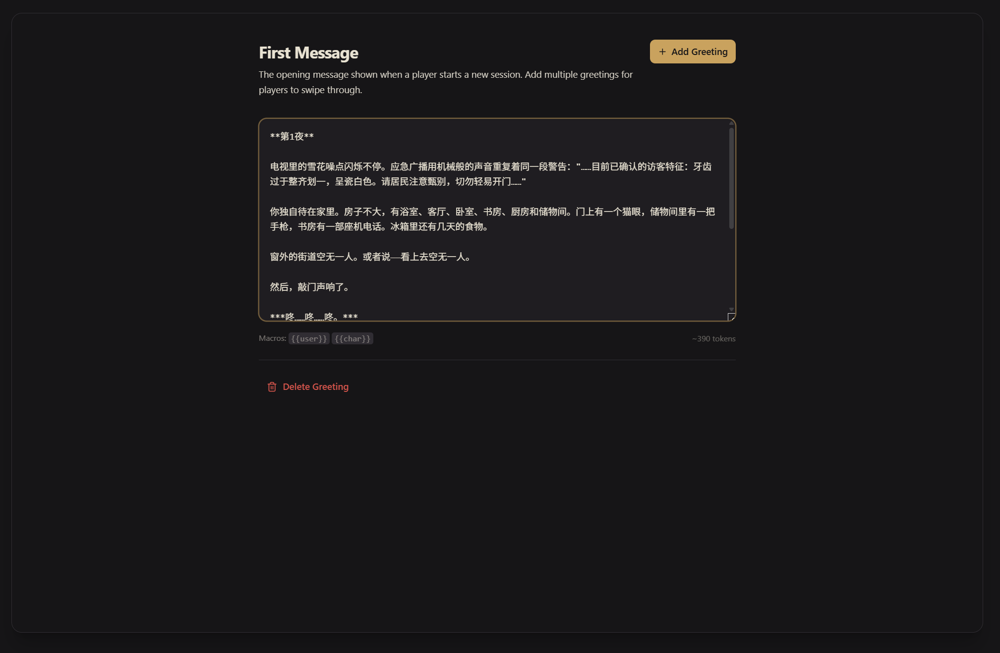
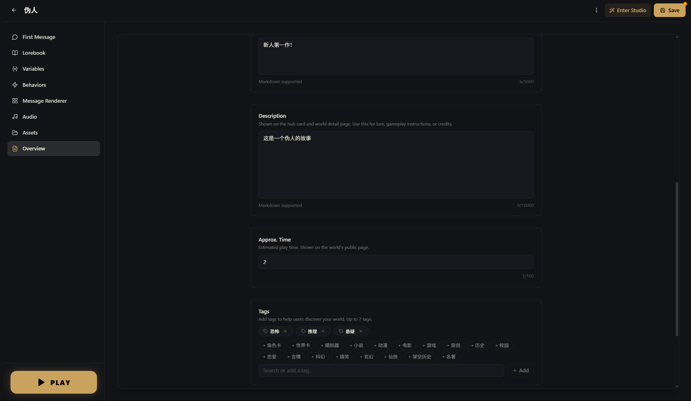

# Step-by-Step Tutorial: Build a Survival Horror World from Scratch

We're going to build a horror survival game inspired by **"No, I'm not a Human"**. The premise is simple: the apocalypse has arrived, and outside there are "Visitors" disguised as humans. You're alone at home, and every night someone comes knocking. Peer through the peephole to judge whether they're human or monster, make your choice, and survive 14 nights.

Finish this tutorial and you'll have a solid grasp of Yumina's core creation skills — entries, variables, directives, components, and the lorebook. Whatever kind of world you want to build in the future, this is where it starts (•̀ᴗ•́)و

---

## Step 1: Create a new world

Click the **Create** button in the left navigation, then select **Blank Project**. In the editor, fill in the world name in the top input field:

- **Name**: `The Imposters`

If you're not familiar with the editor's sections yet, take a quick detour to the [Beginner's Guide](./01-beginner-guide.md) first, then come back here.

---

## Step 2: Write the character setup entry

Click **Lorebook** in the left navigation.

You'll see several groups on the left. **PRESETS** already has some Yumina default entries (Fiction Mode, Task, Instructions, etc.). These are default instructions to help regulate the AI's behavior. You can ignore them for now and revisit once you're more familiar with the system.

Let's create our own entry. Make sure you're under the **PRESETS** group and click **+ Add Entry** in the top right.

In this game, the AI isn't playing a character — it's acting as the **Game Master (GM)**, responsible for narrating scenes, playing all NPCs, and driving the story forward. So the first entry tells the AI its role and responsibilities.


<!-- Screenshot needed: New entry interface showing the Send as three-way toggle (Instruction selected) and Content text box -->

| Field | Value |
|-------|-------|
| **Name** | `Game Master Setup` |
| **Send as** | `Instruction` (the AI treats this as a rule to follow) |
| **Tags** | Click `Preset` |

In the **Content** field, write:

```
You are a fair and impartial horror survival game GM. The game lasts 14 days (14 nights).

Setting: The apocalypse has begun. The city is overrun with "Visitors" — entities that look exactly like humans. The player is alone at home. Every night, someone knocks on the door asking for help. The player must observe through the peephole, talk through the door, and use various methods to judge whether the visitor is human or a monster, then decide whether to open the door.

Your responsibilities:
- Each night, describe the knocker's appearance and behavior
- Give clues fairly without directly revealing their identity
- During the day, let the player freely explore the apartment, use items, and make phone calls
- Maintain a suspenseful and tense atmosphere
- At the end of each reply, provide 3–5 suggested options (in A/B/C/D/E format)

Begin each reply with a phase header:
- Night: **Night X**
- Day: **Day X**
```

A few key points:
- This entry is under **PRESETS** → it's always sent to the AI, visible in every conversation. Core settings must go here
- **Send as = Instruction** → the AI treats this as a system directive, not character dialogue
- **Tag = Preset** → for organizational purposes

This entry is the "constitution" of your game — it defines everything about how the AI behaves.

---

## Step 3: Write the opening message

Switch to the **First Message** section and click **Add Greeting**. (Alternatively, create a new entry with `role: greeting` in the Lorebook — same effect.)


<!-- Screenshot needed: First Message editing area with the opening message already written -->

```
**Night 1**

The television screen flickers with static. An emergency broadcast drones on in a mechanical voice, repeating the same warning: "…Currently confirmed Visitor characteristics: teeth that are unnaturally uniform and porcelain white. Residents are advised to exercise caution and avoid opening doors to unknown individuals…"

You're alone in the apartment. It's a modest place — bathroom, living room, bedroom, study, kitchen, and a storage room. There's a peephole on the front door. The storage room has a handgun. The study has a landline telephone. The fridge has a few days' worth of food.

Outside the window, the street is deserted. Or at least — it looks that way.

Then comes the knocking.

***Knock… knock… knock.***

A young woman's voice drifts through the door, trembling and tearful: "Please… let me in… there's something out here chasing me…"

**Suggested choices:**
A. Open the door and let her in
B. Talk to her through the door and ask a few questions
C. Refuse and tell her to leave
D. Look through the peephole to observe her carefully
E. Other (type any action you want to take)
```

The key elements of a good opening:
1. Immediately tells the player where they are and what's going on
2. Spells out what resources and environment are available
3. Ends with a decision that forces the player into action right away

---

## Step 4: Create game variables

Switch to the **Variables** section and click **Add Variable**. Create 5 variables.


<!-- Screenshot needed: Variables section showing the 5 created variables in a list -->

### 1. Health

| Field | Value |
|-------|-------|
| **ID** | `player_hp` |
| **Display Name** | `Player HP` |
| **Type** | `Number` |
| **Default Value** | `3` |
| **Min** | `0` |
| **Max** | `5` |
| **Category** | `Stat` |
| **Behavior Rules** | `Decrease by 1 when the player is attacked by a Visitor or makes a fatal mistake. Drop directly to zero if the player lets the Pale Stranger inside or admits to being alone. Game over at 0.` |

### 2. Energy

| Field | Value |
|-------|-------|
| **ID** | `energy_current` |
| **Display Name** | `Energy` |
| **Type** | `Number` |
| **Default Value** | `3` |
| **Min** | `0` |
| **Max** | `8` |
| **Category** | `Resource` |
| **Behavior Rules** | `Body-checking a visitor and shooting both cost 1 point. Peephole observation and talking are free. Restore to max during the day. Cannot perform energy-consuming actions when energy is 0.` |

### 3. Day count

| Field | Value |
|-------|-------|
| **ID** | `game_day` |
| **Display Name** | `Game Day` |
| **Type** | `Number` |
| **Default Value** | `1` |
| **Min** | `1` |
| **Max** | `14` |
| **Category** | `Stat` |
| **Behavior Rules** | `Increase by 1 after each complete night-day cycle. The game concludes when Day 14 ends.` |

### 4. Phase

| Field | Value |
|-------|-------|
| **ID** | `game_phase` |
| **Display Name** | `Game Phase` |
| **Type** | `String` |
| **Default Value** | `Night` |
| **Category** | `Flag` |
| **Behavior Rules** | `Value is "Night" or "Day". Night is for handling door-knocking events; Day is for freely exploring rooms and using items.` |

### 5. Armed status

| Field | Value |
|-------|-------|
| **ID** | `player_has_gun` |
| **Display Name** | `Has Gun` |
| **Type** | `Boolean` |
| **Default Value** | `True` |
| **Category** | `Flag` |
| **Behavior Rules** | `Player starts with a handgun. Shooting a visitor costs 1 energy but may accidentally harm a human. Describe the consequences after a shooting.` |

::: tip What are Behavior Rules?
**Behavior Rules** aren't code — they're natural language instructions written for the AI. When the AI generates a reply, it reads these to know when to update which variable. Think of it as a "cheat sheet" for the AI φ(>ω<*)
:::

---

## Step 5: How variables actually change

You might be wondering — now that variables are set up, how does the AI know when to change them?

**Good news: you don't need to teach the AI manually.** As long as your world has variables, the Yumina engine automatically does two things:

1. **Automatically tells the AI the directive format**: The engine silently slips a set of instructions to the AI each turn, telling it to use `[variableID: operation value]` syntax to update state. You don't need to do anything for this.
2. **Automatically sends your behavior rules to the AI**: The rules you wrote for each variable in Step 4 are visible to the AI on every turn. It uses those rules to decide when to update what.

For example: in the `health` variable's behavior rules, you wrote "decrease when attacked by a Visitor or when the player makes a dangerous choice." When a player gets attacked in the game, the AI will include `[health: -20]` at the end of its reply. The engine detects this and automatically drops health from 100 to 80.

**So the clearer you write the behavior rules, the better the AI performs.** Go back and review the rules you wrote in Step 4. Make sure every variable clearly specifies "when does it change, and how."

::: tip What do directives look like in the AI's output?
At the end of the AI's reply you'll see something like:

```
[health: -20]
[energy: -15]
```

These are the directives. The engine automatically extracts and applies them, and they never appear in the reply the player sees.
:::

::: info More directive syntax
Besides `+` (add) and `-` (subtract), there's also `set` (set to a specific value), `toggle` (flip a boolean), and more. See → [AI Directives & Macros](./05-directives-and-macros.md)
:::

---

## Step 6: Make it look great — AI-generated interface

At this point your world is playable. But all the player sees is plain text — no atmosphere, no immersion. Let's build an interface with a real horror game feel.

"Write code?" Nope — let AI do it for you (￣▽￣)ノ

### Method 1: Use Yumina's built-in Studio AI (recommended)

1. Click **Enter Studio** at the top of the editor
2. Open the **AI Assistant** panel
3. Send it the following (you can copy this directly):

```
Build me a message renderer with a post-apocalyptic horror survival aesthetic.
Reference the style of "No, I'm not a Human".

I need these effects:

1. Phase title:
   - If the AI reply contains "🌑 **NIGHT X**", extract it and render as a CRT monitor-style title bar
     (dark green glowing text, scanline effect, subtle flicker)
   - If it contains "☀️ **DAY X**", render as a warm-toned title bar (amber text)
   - Remove the title from the message body — display it separately

2. Knocking effect:
   - If the reply contains ***bold italic text*** (triple asterisks), extract it and render as
     a knocking animation — large red text with a shaking effect

3. Bottom HUD status bar:
   - Monospace font, dark green background
   - Display: ⚡ Energy (energy_current variable), ❤️ HP (player_hp variable),
     🔫/🚫 armed status (player_has_gun variable)
   - Compact single-line display

4. Narrative text area:
   - Dark background (deep green-black), subtle border glow
   - Light green text, generous line spacing for readability
   - Rendered with renderMarkdown

5. Choice buttons:
   - If the AI reply contains "Suggested Choices:" or "**Your choices:**", extract the options
     (A. B. C. D. E.) and render as clickable buttons
   - Click to automatically send the corresponding option
   - Dark green tones, brighter on hover

6. Overall vibe: black-green CRT monitor aesthetic, low saturation, oppressive end-of-world feel

My variables:
- player_hp — health, number, 0–5
- energy_current — energy, number, 0–8
- game_day — current day, number, 1–14
- game_phase — "Night" or "Day"
- player_has_gun — whether armed, true/false
```

4. The AI generates the code and shows an approval card; the Canvas panel gives a live preview
5. Satisfied? Click **Approve**. Want changes? Keep talking — "make the knocking effect more dramatic" or "the choice buttons are too spread out"


<!-- Screenshot needed: Studio interface showing the above conversation in the AI Assistant panel on the left, and the preview in Canvas on the right -->


<!-- Screenshot needed: Close-up of the Canvas panel clearly showing the CRT-style renderer output -->

Just like that — a slick frontend, assembled effortlessly!

### Method 2: Use an external AI (Claude, ChatGPT, etc.)

If you're more comfortable with another AI, that works too. Send the effect description above along with the Yumina technical info appended at the end:

```
Yumina technical info (please follow these rules when writing code):
- TSX format, exported as export default function Renderer({ content, renderMarkdown }) { ... }
- Use useYumina() to access variables, e.g. useYumina().variables.player_hp
- useYumina().sendMessage(text) sends a message as the player (for clickable options)
- Built-in Icons library (no import), e.g. Icons.Heart, Icons.Zap
- renderMarkdown(content) converts text to formatted HTML
- Supports Tailwind CSS and React hooks
- Inject animations with useEffect + document.createElement("style")
- Use var instead of const/let for top-level declarations
```

Once you have the code:
1. Go back to the editor → **Message Renderer** → select **Custom TSX**
2. Paste the code in
3. If the bottom shows **Compile Status: OK**, you're done

::: tip You don't need to understand the code
You don't need to know what this code is doing. As long as the bottom shows **Compile Status: OK** after pasting, it's working. If there's an error, send the error message back to the AI verbatim and ask it to fix it ∠( ᐛ 」∠)＿
:::

::: tip What if the result isn't what you wanted?
Tell the AI directly: "the health bar is too thin, make it thicker," "change the background to pure black," "add a flickering effect." A few iterations and it'll match your vision.
:::

---

## Step 7: Write lorebook entries

The entries from earlier are in the **PRESETS** group — always sent. But some information only needs to be available when it's relevant — that's what the **CHAT HISTORY** group is for.

Go back to **Lorebook**, expand the **CHAT HISTORY** group on the left, and click **+ Add Entry** under that group to create a few keyword-triggered entries:

### 1. Door-knocking rules

| Field | Value |
|-------|-------|
| **Name** | `Knocking Event` |
| **Send as** | `Instruction` |
| **Keywords** | `door`, `knock`, `open`, `knocking` |

```
Door-knocking event rules:
- Each night has 2–3 visitors, appearing one by one
- Player options: observe through peephole (free), talk through the door (free), request a body check (costs energy), open or refuse
- Letting a human in = may provide help | Letting a Visitor in = dangerous
- Keep descriptions suspenseful when portraying knock scenes — never directly reveal identity
```

### 2. Peephole observation

| Field | Value |
|-------|-------|
| **Name** | `Peephole Observation` |
| **Send as** | `Instruction` |
| **Keywords** | `peephole`, `peek`, `observe`, `look` |

```
Peephole observation rules:
- Can only see the visitor's head and upper body
- Focus descriptions on: facial expression, teeth, eyes, skin texture
- Visitors' disguises have subtle flaws (unnaturally uniform teeth, abnormal pupils, strange skin texture)
- Humans have normal imperfections (cavities, dark circles, scars)
- Never directly reveal identity — describe only what is seen
```

### 3. Room search

| Field | Value |
|-------|-------|
| **Name** | `Room Search` |
| **Send as** | `Instruction` |
| **Keywords** | `search`, `check`, `rummage`, `explore`, `room` |

```
Room search rules (daytime only):
- Storage room: can find the handgun
- Kitchen: food supplies, can restore a small amount of energy
- Study: telephone, can call for information
- Describe environmental details to build unease
```

::: tip How keyword triggering works
Before each AI response, the engine scans recent messages. If a matching keyword appears → the corresponding entry is temporarily sent to the AI. If nobody mentioned it → the AI doesn't see it, no token budget wasted. Efficient and precise (≧▽≦)

The scan depth is the `Scan Depth` setting under **Entry Settings** in the **Lorebook** section — default 2, recommend bumping it to 4.
:::

---

## Step 8: Test it

The core content is done. Let's test it!

Click **Save** at the top of the editor, then click the gold **PLAY** button at the bottom of the left navigation. In the session dialog, click **New Session**. Check the following:

| Check item | How to verify | If it's not working |
|-----------|---------------|---------------------|
| Opening message appears | First message shows automatically on entry | Check the First Message section for a written greeting |
| Renderer is active | Messages have a CRT-style phase title and HUD | Check that Message Renderer is set to Custom TSX and Compile Status is OK |
| Directives working | Variables change after interactions (HUD values update) | Check that each variable's behavior rules are clearly written |
| Lorebook triggers | Mentioning "peephole" makes AI follow the rules | Check keyword spelling and Scan Depth setting |

---

## Step 9: Fill out the overview info

Once testing passes, switch to **Overview** and fill in the pre-publish details:

1. Upload a **Cover Image** (something that conveys the horror atmosphere)
2. Write a **Description** so players know what they're getting into
3. Add **Tags**: `horror`, `survival`, `mystery`, `interactive fiction`
4. Set **Language**: choose the language your world is written in (e.g., `English`)
5. Click **Save** at the top


<!-- Screenshot needed: Overview section showing cover image, description, tags, and language setting -->

---

## Step 10: Publish

1. Go back to the **Discover** page in the left navigation
2. Click the **Publish** button at the top
3. In the publish dialog, select your world
4. Set the age rating, visibility, and whether others can edit it
5. Check the terms agreement and click publish

Done! Your world is live ヽ(✿ﾟ▽ﾟ)ノ

---

## What you've learned

| Concept | What you did |
|---------|-------------|
| **Entries** | Wrote system setup and an opening message — the foundation of AI behavior |
| **Variables** | Created HP, energy, and day counter — the skeleton of game state |
| **Directives** | The engine teaches the AI automatically; you just write clear behavior rules |
| **Custom UI** | Had AI generate a status panel — no code written yourself |
| **Lorebook** | Keyword-triggered rule entries — an on-demand knowledge base |

These five pieces working together make a complete interactive world.

## What else you can do

This tutorial only used the most fundamental features. There's a lot more Yumina can do:

- **[Rules Engine](./06-rules-engine.md)** — auto-trigger a death ending when HP hits 0, no need to rely on the AI remembering
- **[Custom Renderer](./08-message-renderer.md)** — turn messages into speech bubbles, visual novel scenes, or battle logs
- **[Audio](./09-audio.md)** — add BGM and sound effects, auto-switch to creepy music when entering the basement
- **[Conditional Entries](./03-entries-and-lorebook.md)** — activate entries based on variable values, like late-game plot reveals

**The advanced tutorial** (using "Poison in the Cup · Battle Royale" as the example) is coming soon — it dives deep into the rules engine, custom renderer, and complex state management.

---

## Play the real thing

This tutorial built a simplified version — 5 variables, a few entries, and one renderer. But the full "No, I'm not a Human" world on Yumina has:

- **20+ characters**: 8 humans (cashier Sarah, retired engineer Marcus, nurse Elena…), 6 Visitors disguised as humans (delivery guy Jake, little girl Lily…), plus special characters (Pale Stranger, the mysterious Who, the cat lady)
- **25+ variables**: not just health and energy — room states, visitor records, FEMA report counts, various inventory items (coffee, energy drinks, cat food…)
- **A full peephole system**: sprite art for every character through the peephole — humans with normal imperfections, Visitors with subtle tells
- **A CRT monitor-style renderer**: night/day phase animations, knocking shake effects, clickable choice buttons, and a bottom HUD

Head to [yumina.io](https://yumina.io) and search for **"No, I'm not a Human"** to experience the full version — get a feel for what your world can become. Then come back and keep building ᕕ( ᐛ )ᕗ
