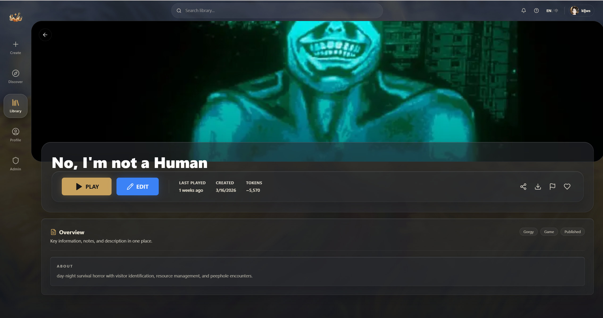

# My Library

Click the left navigation or the back button from the chat page to reach **My Library** — your personal game collection.

## Games: worlds you've played

This is the default tab, showing all the worlds you've added to your library.

**Info on each card:**
- Cover thumbnail
- World name
- Blue dot — indicates the world has an update
- Gold heart — worlds you've favorited

**Card actions (appear on hover):**
- **Gamepad icon** — continue playing
- **Pencil icon** — edit (creates a copy in your projects)
- **Download icon** — export as JSON
- **Trash icon** — remove from library

### Sorting

The sort dropdown in the top right:
- **Alphabetical** — sort by name
- **Recent** — sort by last played time
- **Added** — sort by when you added it

### Favorites

Click the heart icon in the top right of any card to favorite or unfavorite it. Favorited worlds are **pinned to the top** regardless of sort order.

### Search

The search bar at the top lets you search your library by world name.

### Empty library

If your library is empty, you'll see "Your Library is Empty" along with a **Browse Discover** button to take you to the Hub.

## Detail panel

Click any world card and a detail panel expands on the right:

**Panel contents:**
- Large cover image
- World name and creator info
- Three action buttons:
  - **PLAY** (gold) — start or continue playing
  - **EDIT** (blue) — edit (copies to your projects)
  - **ROOM** (green) — create a multiplayer room (if the world supports it)
- Stats: last played time, creation date, token usage
- World description, tags, and announcements

**Icon buttons in the top right:**
- Share, download JSON, report, favorite

## Session management

A single world can have multiple independent saves (sessions).

Click **PLAY** to bring up the session picker:
- List of existing sessions: shows message count, last message preview, and timestamp
- **+ New Session** — start a fresh save
- Multi-language worlds show language tabs at the top

## My Projects: your creations

The second tab shows worlds you've created or copied, split into two areas:
- **In Development** — drafts you're still working on
- **Published** — worlds you've already released

If you haven't started creating yet, you'll see a **Create a Project** button to take you to the editor.

For the full creation workflow, check out the [Creator Guide](/en/creator-guide/00-welcome).

## Assets: your files

The third tab manages your uploaded files:

- Supports images (PNG, JPG, WebP, SVG), audio (MP3, WAV, OGG), and fonts (TTF, OTF, WOFF)
- Folder tree on the left with drag-and-drop organization
- Copy asset references (`@asset:xxx`) or public URLs
- Storage limit: 50 GB

## Bundles: resource packs

The fourth tab shows resource packs you've collected. Bundles are packaged asset sets from creators (entries, variables, components, rules, etc.) — mostly used during creation.

Head to the Bundles tab in the Hub to browse and add more.

---

Up next: playing with friends (๑•̀ㅂ•́)و✧
