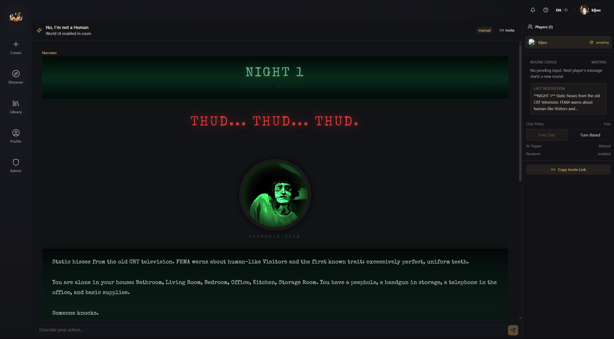

# Multiplayer Rooms

Yumina supports multiplayer — you and your friends can adventure through the same world together.

## Creating a room

1. Find a world in your library that supports multiplayer (the detail panel will have a green **ROOM** button)
2. Click **ROOM**
3. Choose an AI trigger mode (determines when the AI responds — more on that below)
4. The room is created and you're taken right in

## Inviting friends

Once you create a room, you're the host. Click the **Copy Invite Link** button at the bottom of the right panel and send the link to your friends.

When a friend opens the link:
- If already logged in → they join the room automatically
- If not logged in → they're taken to the login page first, then join automatically after logging in

## Room interface

The room is split into two areas:

### Left: chat / narrative area
- AI narration and messages from all players
- Input box at the bottom, same as single-player

### Right: control panel
- **Players** — list of online players (host has a crown icon 👑)
- **Round status** — shows whether you're waiting for input, collecting messages, or waiting for AI
- **Speech mode toggle** — the host can switch modes (more details below)
- **AI trigger button** — manually prompt the AI to respond
- **Invite link button** — generate a new invite link at any time

## Speech modes

The host can switch between two modes:

| Mode | Description |
|------|-------------|
| **Free speech** | Everyone can send messages at any time; messages queue up and the AI responds to them all together |
| **Turn-based** | Only one person can speak at a time; the host designates who goes next |

Turn-based works great for a more structured narrative experience, while free speech is perfect for lively group chaos ✧

## AI trigger modes

The trigger mode chosen when creating the room determines when the AI responds:

- **Manual** — the host manually clicks a button to trigger an AI response
- **Timer** — set a time interval; AI responds when the timer runs out
- **Round** — AI responds after everyone has sent a message
- **Instant** — AI responds the moment any message is received

## Roles and permissions

| Role | What they can do |
|------|-----------------|
| **Host** | Full control: invite, switch modes, trigger AI, manage the room |
| **Player** | Send messages and participate in the game |
| **Spectator** | Watch only — can't send messages (identified by an eye icon) |

## Game flow

A typical multiplayer round looks like this:

1. **Waiting for input** — everyone types out their actions
2. **Collecting** — messages queue up; you can see the pending list in the right panel
3. **AI responding** — the AI combines all player input into a single narrative response
4. Back to step 1 for the next round

---

Next up: what you can do on your profile page ᕕ( ᐛ )ᕗ
