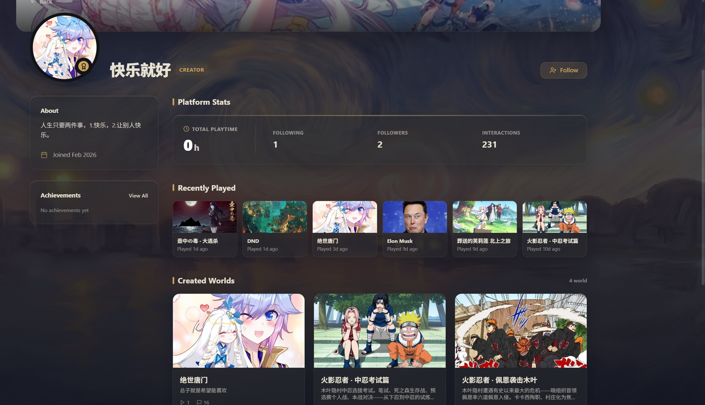

# Profile & Social

## Your profile

Click your avatar in the top right or navigate to your profile page.

### Header area
- **Banner image** — the large image at the top, fully customizable
- **Avatar** — bottom left, with a small gold badge
- **Display name and username** — in @username format

### Sidebar (left)
- **About** — your bio, location, website link, and join date
- **Achievements** — achievements earned across different worlds (four tiers: Legendary, Epic, Rare, and Common)
- **Creator Hub** — quick link to jump to the creator section

### Main content area

**Platform stats:**
- Total playtime
- Following and follower counts (click to see the full list)
- Interaction count

**Recently played:**
- A grid of worlds you've played recently — click any to jump back in

**My Creations:**
- Your published worlds, split between drafts and published

**Favorites & Collections:**
- Quick access to your favorites list

## Editing your profile

Click **Edit Profile** on your profile page to open the edit dialog:

**What you can change:**
- **Avatar** — click to upload a new image (JPEG, PNG, GIF, WebP supported)
- **Banner** — click to upload (recommended 1500x500px)
- **Display Name** — your visible name
- **Username** — your @handle (letters, numbers, underscores, up to 30 characters)
- **About You** — bio (up to 300 characters)
- **Location** — where you're from
- **Website Link** — your personal site

Click **Save Changes** when you're done.

## Following system

### Following others
- Click the **Follow** button on someone's profile
- After following, the button changes to **Following** — click again to unfollow
- When people you follow publish new worlds, they'll show up in the Following tab in the Hub

### Viewing your follow lists
- **Following** — people you follow
- **Followers** — people who follow you
- Click the numbers in the stats area on your profile to navigate there

## Ratings and reviews

You can rate and review worlds you've played:

- In the world details dialog, switch to the **Reviews** tab
- Choose a 1–5 star rating
- Optionally write a comment (rating only is fine too)
- All your reviews are visible on the Reviews tab of your profile

## Viewing other people's profiles

Click any username or avatar you see anywhere to jump to their public profile.

You can see:
- Their bio and stats
- Worlds they've played recently
- Worlds they've created and published
- Their achievements
- Their reviews

You can't see:
- Their settings and configuration
- Activity and creations if they have a private profile and you're not following them

---

Last one — let's see what's in Settings (•̀ᴗ•́)و
