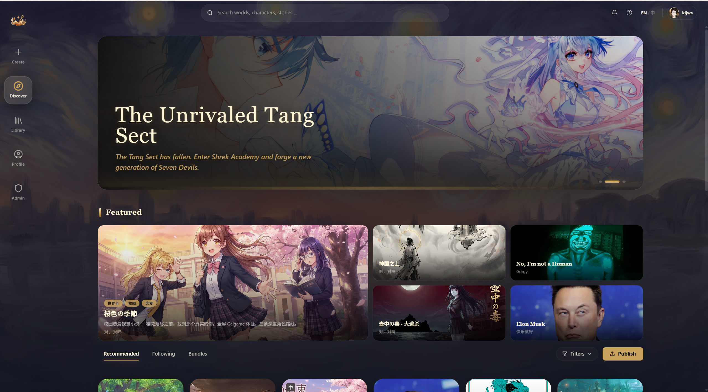

# 什么是 Yumina

## 一句话版本

Yumina 是一个 **AI 互动小说平台**——你可以在上面玩别人做的互动世界，也可以自己创作一个分享出去。

## 稍微展开说

想象一下：你打开一个"末日生存"的世界，AI 会扮演叙述者和里面的角色，根据你的选择推进剧情。你说"我要打开那扇门"，AI 就会描述门后的场景——可能是一间空荡荡的仓库，也可能是一群丧尸 (((ﾟДﾟ;)))

和传统视觉小说不同，这里没有写死的剧情分支。AI 会根据世界的设定（创作者定义的规则、角色、变量等）实时生成内容，每次玩都不一样。

和普通的 AI 聊天也不一样——Yumina 的世界有**游戏状态**。你的血量会掉、金币会涨、好感度会变化，这些都会影响剧情走向。创作者还可以给世界加上自定义界面，比如血条、背包、地图，甚至视觉小说风格的立绘和对话框。

## 你能拿 Yumina 做什么

**当玩家：**
- 浏览社区里几百个世界，各种题材都有——恋爱、恐怖、悬疑、科幻、搞笑……
- 直接开玩，AI 实时生成剧情
- 给喜欢的世界打分、收藏、关注创作者
- 和朋友一起多人联机玩同一个世界

**当创作者：**
- 用编辑器从零搭建你自己的互动世界
- 设定角色、规则、变量、自定义 UI
- 发布到社区让其他人来玩
- 详见 [创作者指南](/creator-guide/00-welcome)

## 准备好了？

下一篇教你怎么注册账号 ᕕ( ᐛ )ᕗ
