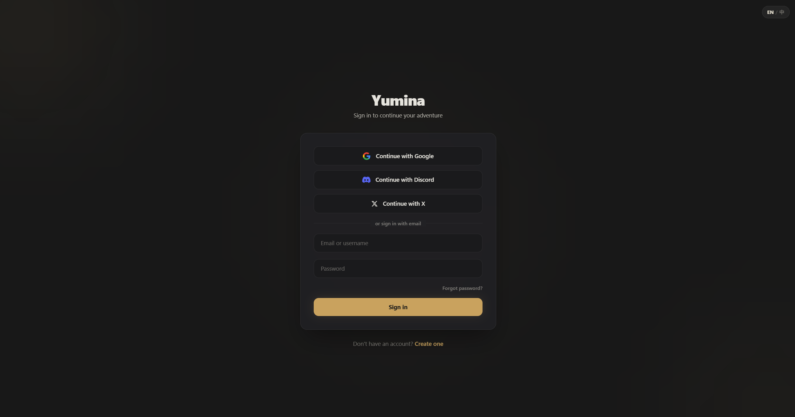
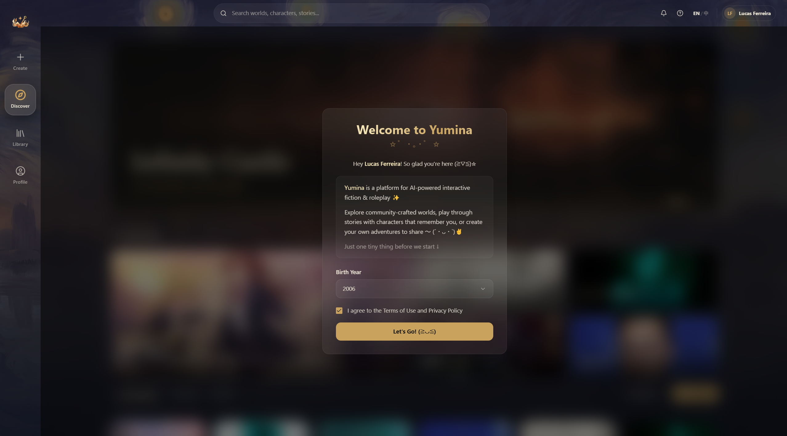

# 注册与登录

## 创建账号

打开 Yumina，你会看到登录页面。注册有两种方式：

### 方式一：社交账号一键注册

点页面上的按钮，选一个你有的平台：

- **Continue with Google** — 用谷歌账号
- **Continue with Discord** — 用 Discord 账号
- **Continue with X** — 用 X（推特）账号

点完就跳转授权，完了自动登录，最省事 ✧(≖ ◡ ≖✿)

### 方式二：邮箱注册

如果你不想用社交账号，也可以用邮箱：

1. 填 **Name**（你的昵称）、**Email**（邮箱）、**Password**（密码，至少 8 位）
2. 点 **Create account**
3. 跳到验证页面，提示你去邮箱查收验证邮件
4. 打开邮件里的链接，验证完成

没收到邮件？点 **Resend verification email** 再发一封。

## 首次登录：新手引导

第一次登录成功后，会弹出一个欢迎弹窗，需要你完成两件事：

1. **选择出生年份** — 从下拉菜单选。Yumina 要求至少 13 岁才能使用
2. **同意使用条款** — 勾选"I agree to the Terms of Use and Privacy Policy"

都搞定后点 **Let's Go!** 就正式进入了 ᕕ( ᐛ )ᕗ

## 登录

已经有账号了？在登录页面：

- **Identifier** — 填邮箱或用户名都行
- **Password** — 你的密码
- 点 **Sign in** 就完事了

也可以用 Google / Discord / X 一键登录，和注册时一样的按钮。

## 忘记密码

1. 在登录页面点 **Forgot password?**
2. 输入你的注册邮箱，点 **Send reset link**
3. 去邮箱找重置链接
4. 点链接后设置新密码（至少 8 位），确认一遍
5. 重置成功，点 **Sign in** 用新密码登录

