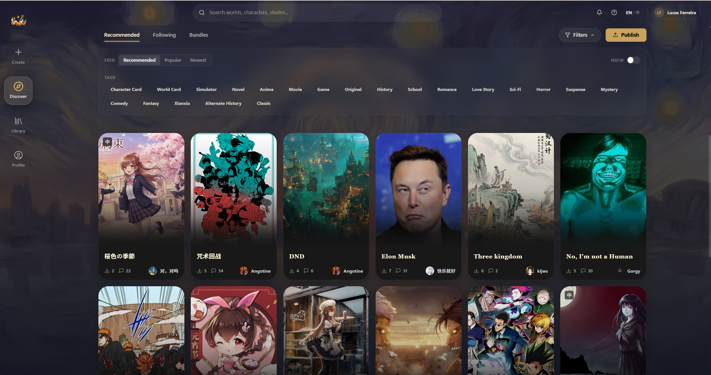
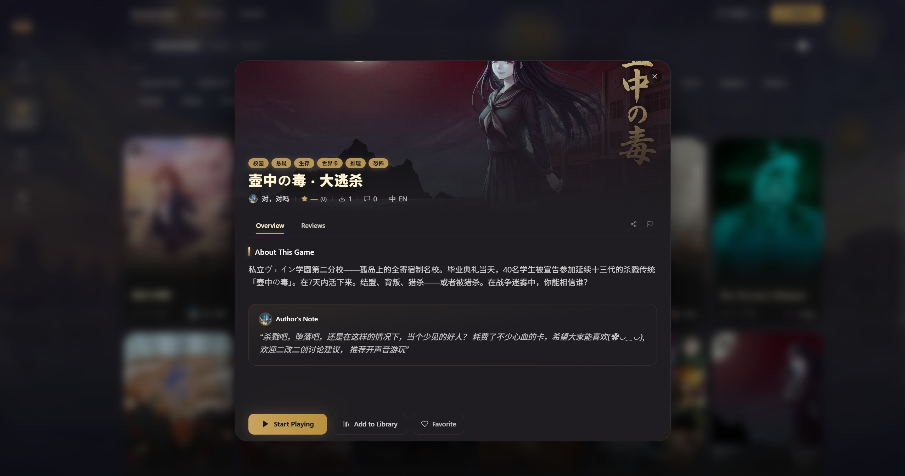

# 探索世界

登录后你会进入 **Hub**——Yumina 的世界发现中心。这里能浏览社区里所有公开的世界。

## Hub 的三个 Tab
页面顶部有三个标签页：

| Tab | 干嘛的 |
|-----|--------|
| **推荐** | 默认首页，展示推荐和热门世界 |
| **关注** | 你关注的创作者发布的世界（没关注过人就是空的） |
| **Bundles** | 资源包市场，创作者用的素材包（玩家一般用不到） |

## Featured 精选区

Hub 顶部有一个精选轮播区，编辑推荐的优质世界，会自动轮播。点击任何一个卡片就能查看详情。

## 世界卡片

每个世界显示为一张卡片，上面能看到：

- **封面图** — 世界的缩略图
- **标题** — 世界名称
- **作者** — 创作者头像和名字
- **下载量和评论数** — 左下角的小图标
- **语言标签** — 左上角（如果有的话）
- **标签** — 鼠标悬停时右上角会显示

鼠标放上去卡片会微微抬起，还能看到世界的简介 ✨

## 筛选和排序

点顶部的 **Filters** 按钮，打开筛选面板：

**排序方式：**
- **Recommended** — 推荐排序（默认）
- **Popular** — 按热度
- **Newest** — 按发布时间

**标签筛选：**
可以选一个或多个标签来过滤，比如：角色卡、世界卡、恋爱、恐怖、科幻、悬疑、搞笑……

**NSFW 开关：**
默认关闭。打开后会显示成人内容（需要 18 岁以上，在设置里调）。

## 世界详情

点击一个世界卡片，会弹出详情弹窗：

**能看到：**
- 封面大图和画廊
- 标题、标签、创作者信息
- 星级评分和下载量
- 世界介绍（About This Game）
- 创作者公告（如果有的话）

**能做的操作：**
- **Start Playing** — 开始游戏（金色大按钮）
- **Add to Library** — 加入我的库
- **收藏（心形图标）** — 收藏到最爱
- **分享** — 复制链接
- **举报** — 如果有不当内容

**评论 Tab：**
切到评论标签页可以看到其他玩家的评分和评价，也可以自己写一条。

## 分类浏览

除了主 Tab，Hub 还支持按分类浏览精选合集，比如"今日推荐"、"关注作者的作品"等。

---

找到感兴趣的世界了？下一篇教你怎么开始游戏 (•̀ᴗ•́)و
