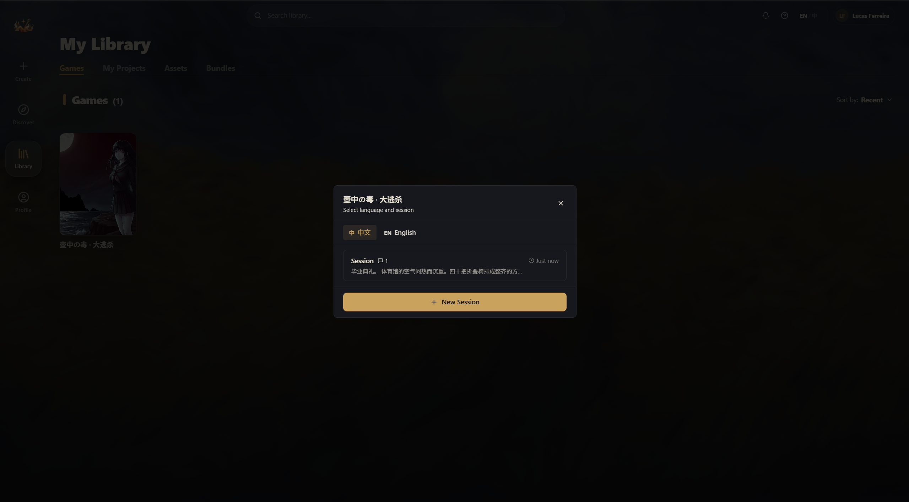

# 开始游戏

找到想玩的世界后，点 **Start Playing**，你的冒险就开始了。

## 选择会话

点开始后会弹出一个会话选择窗口：

- 如果是第一次玩，点 **+ New Session** 创建新存档
- 如果之前玩过，可以选一个已有的会话继续
- 每个会话显示消息数量和上次游玩时间
- 同一个世界可以开多个会话，互不影响

如果世界支持多语言，顶部还会有语言切换标签。

## 聊天界面

进入游戏后，你会看到聊天界面：

**AI 消息（叙述者）：**
- 标注为 **Narrator**
- AI 会根据世界设定讲述故事、扮演角色
- 悬停可以看到生成耗时、token 数量和使用的模型

**你的消息：**
- 标注为 **You**
- 在底部输入框打字，Enter 发送（Shift+Enter 换行）
- 你可以描述任何行动，比如"我打开门"、"我跟她说话"、"我偷偷溜走"

**游戏面板：**
- 如果创作者设置了自定义 UI，可能会有各种各样的美化
- 可能包含背景，字体，血条、背包、属性面板等各种游戏组件

## Swipe：切换 AI 回复

不满意 AI 的回复？用 Swipe 功能：

在最后一条 AI 消息底部，你会看到 `< 1/1 >` 这样的控件：

- **点右箭头 `>`** — 让 AI 重新生成一个新回复
- **点左箭头 `<`** — 切换回之前的版本
- 中间显示 `当前/总数`，比如 `2/3` 表示第三个版本中看第二个

你可以生成好几个版本，挑最喜欢的那个继续玩 ✧(≖ ◡ ≖✿)

## 消息操作

鼠标悬停在任意消息上，会出现一排操作按钮：

| 操作 | 说明 |
|------|------|
| **复制** | 复制消息内容 |
| **编辑** | 修改消息内容（改完点 Save） |
| **重新生成** | 让 AI 重新回复这条（仅最后一条 AI 消息） |
| **撤回到这里** | 删除这条之后的所有消息，回到这个节点 |
| **删除** | 删掉这条消息 |

## 输入框的更多功能

输入框左边有几个按钮：

### + 菜单
- **Continue** — 让 AI 继续写，不需要你说话
- **Restart Chat** — 清空所有消息，重新开始（会确认）
- **Attach Image** — 上传图片附件

### 存档点（书签图标）
- **Save Checkpoint** — 保存当前进度
- **Load Checkpoint** — 读取之前保存的进度

存档点特别适合"关键分支"前使用——先存一个，选错了可以回来重选 ( •̀ω•́ )σ

## 顶部控制栏

聊天界面顶部有一排控制按钮：

| 按钮 | 说明 |
|------|------|
| **↩ 撤回** | 撤回最后一轮对话（你的消息 + AI 的回复） |
| **导出** | 导出聊天记录为 Markdown 或 JSON 文件 |
| **会话列表** | 查看/切换/新建这个世界的所有会话 |
| **沉浸模式** | 全屏显示，隐藏所有 UI，专注阅读 |
| **组件面板** | 显示/隐藏右侧游戏面板（如果有） |

## 缩放控制

输入框左下角有个放大镜图标，点击可以调整游戏界面的缩放比例（20% - 200%），方便不同屏幕大小使用。

## 世界下架了怎么办？

如果创作者下架了世界，你的会话不会丢失：

- 消息历史仍然可以阅读
- 可以导出聊天记录
- 但不能继续发送新消息

---

玩了几个世界了？下一篇看看怎么管理你的收藏 ᕕ( ᐛ )ᕗ
