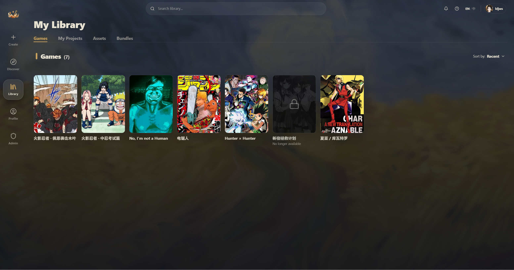

# 我的库

点左侧导航或者聊天页面的返回按钮，就能到达 **My Library**——你的个人游戏库。

## Games：你玩过的世界

这是库的默认标签页，展示你添加到库里的所有世界。

**卡片上的信息：**
- 封面缩略图
- 世界名称
- 蓝色小圆点 — 表示世界有更新
- 金色心形 — 你收藏的世界

**卡片操作（鼠标悬停时出现）：**
- **游戏手柄图标** — 继续游玩
- **铅笔图标** — 编辑（会复制一份到你的项目里）
- **下载图标** — 导出为 JSON
- **垃圾桶图标** — 从库中移除

### 排序

右上角的排序下拉菜单：
- **Alphabetical** — 按名称排序
- **Recent** — 按最近游玩时间
- **Added** — 按添加时间

### 收藏

点卡片右上角的心形图标可以收藏/取消收藏。收藏的世界会在任何排序下都**置顶显示**。

### 搜索

顶部搜索栏可以按名称搜索你库里的世界。

### 空库提示

如果库是空的，会显示"Your Library is Empty"，并有一个 **Browse Discover** 按钮带你去 Hub 逛逛。

## 详情面板

点击任意世界卡片，右侧会展开详情面板：

**面板内容：**
- 大封面图
- 世界名称和创作者信息
- 三个操作按钮：
  - **PLAY**（金色）— 开始/继续游玩
  - **EDIT**（蓝色）— 编辑（会复制到你的项目）
  - **ROOM**（绿色）— 创建多人房间（如果世界支持的话）
- 统计信息：最后游玩时间、创建日期、token 消耗
- 世界介绍、标签、公告

**右上角图标按钮：**
- 分享、下载 JSON、举报、收藏

## 会话管理

一个世界可以有多个独立的存档（会话）。

点 **PLAY** 后弹出会话选择器：
- 已有会话列表：显示消息数、最后一条消息的预览、时间
- **+ New Session** — 新建一个全新的存档
- 多语言世界会在顶部显示语言切换标签

## My Projects：你的创作

第二个 tab 展示你自己创建或复制的世界，分两个区域：
- **In Development** — 还在做的草稿
- **Published** — 已发布的世界

如果你还没开始创作，会看到 **Create a Project** 按钮引导你去编辑器。

详细的创作流程请参考 [创作者指南](/creator-guide/00-welcome)。

## Assets：你的素材

第三个 tab 管理你上传的文件：

- 支持图片（PNG、JPG、WebP、SVG）、音频（MP3、WAV、OGG）、字体（TTF、OTF、WOFF）
- 左侧文件夹树，支持拖拽整理
- 可以复制素材引用（`@asset:xxx`）或公开 URL
- 存储限额：50 GB

## Bundles：资源包

第四个 tab 展示你收藏的资源包。资源包是创作者打包的素材集合（词条、变量、组件、规则等），主要在创作时使用。

可以去 Hub 的 Bundles tab 浏览和添加更多资源包。

---

接下来看看怎么和朋友一起玩 (๑•̀ㅂ•́)و✧
