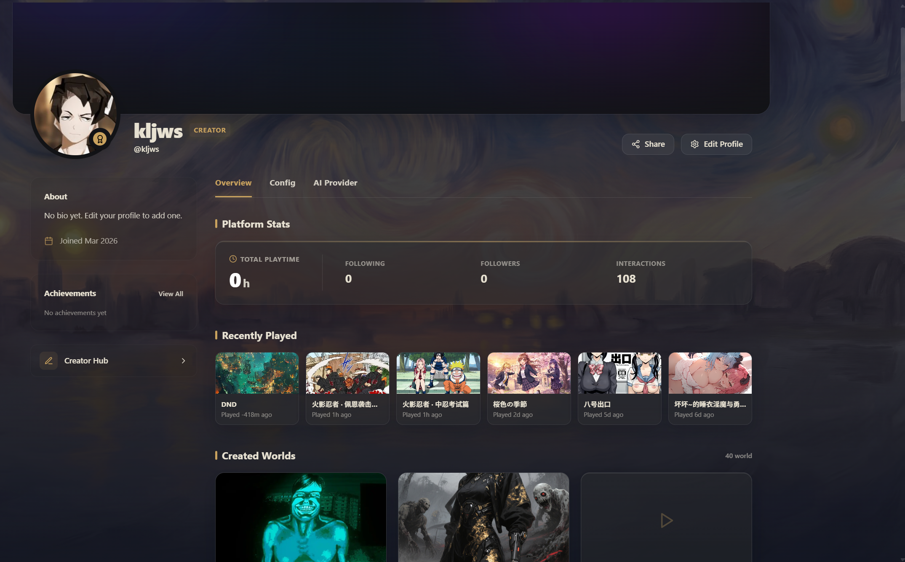
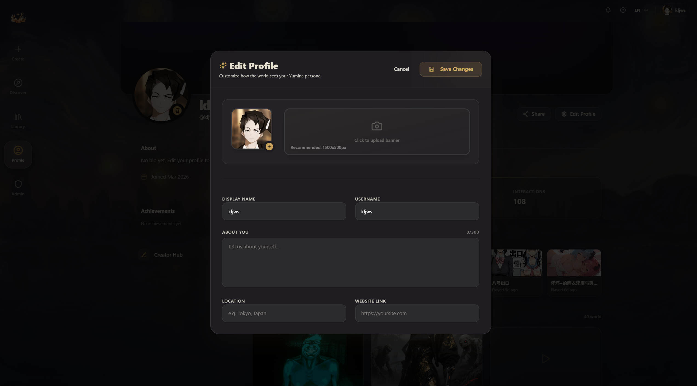

# 个人主页与社交

## 你的主页

点击右上角头像或导航栏进入个人主页。

### 头部区域
- **横幅图** — 顶部大图，可以自定义
- **头像** — 左下角，带金色小徽章
- **昵称和用户名** — @username 格式

### 侧边栏（左侧）
- **About** — 你的简介、位置、网站链接、加入日期
- **成就** — 在各个世界里获得的成就（分为传说、史诗、稀有、普通四个等级）
- **Creator Hub** — 快速跳转到创作页面

### 主内容区

**平台统计：**
- 总游玩时长
- 关注数和粉丝数（可点击查看列表）
- 互动次数

**最近游玩：**
- 你最近玩过的世界网格，点击可以直接继续玩

**我的创作：**
- 你发布的世界，分草稿和已发布

**收藏与合集：**
- 快速跳转到你的收藏列表

## 编辑个人资料

点主页上的 **Edit Profile** 按钮，弹出编辑弹窗：

**可以修改：**
- **头像** — 点击上传新图片（支持 JPEG、PNG、GIF、WebP）
- **横幅** — 点击上传（推荐 1500x500px）
- **Display Name** — 显示昵称
- **Username** — 用户名（字母、数字、下划线，最长 30 位）
- **About You** — 简介（最多 300 字）
- **Location** — 所在地
- **Website Link** — 个人网站

改完点 **Save Changes** 保存。

## 关注系统

### 关注别人
- 在别人的主页上点 **Follow** 按钮
- 关注后按钮变成 **Following**，再点一次可以取关
- 你关注的人发布新世界时，Hub 的"关注"标签页会显示

### 查看关注列表
- **Following** — 你关注的人
- **Followers** — 关注你的人
- 在主页的统计区域点数字就能跳转

## 评分和评论

你可以给玩过的世界打分和写评论：

- 在世界详情弹窗里切到 **Reviews** 标签页
- 选 1-5 星评分
- 可以写一段评论（也可以只打分不写）
- 你写过的所有评论可以在主页的 Reviews 标签页查看

## 查看别人的主页

点击任何地方出现的用户名或头像，都可以跳到他们的公开主页。

你能看到：
- 他们的简介和统计数据
- 最近玩过的世界
- 他们创作和发布的世界
- 他们的成就
- 他们的评论

看不到的：
- 他们的设置和配置
- 如果开了私密主页，非粉丝看不到活动和作品

---

最后一篇，来看看设置里都有啥 (•̀ᴗ•́)و
