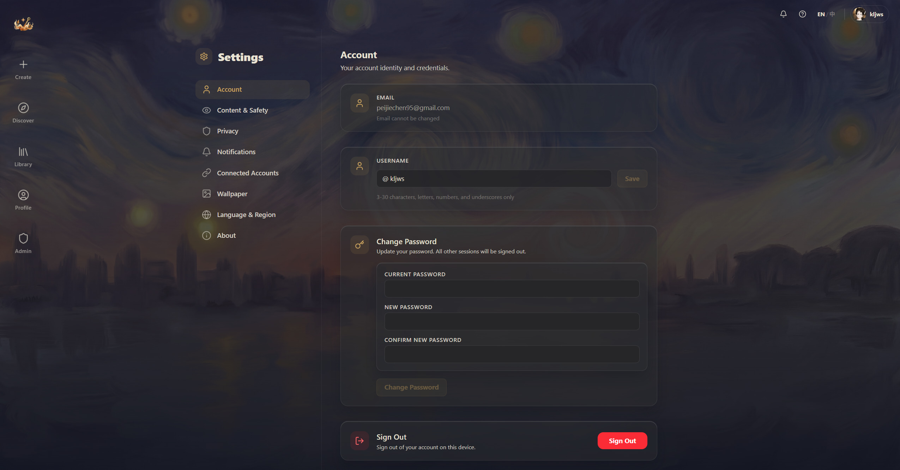

# Settings

Click the settings icon in the navigation bar to open the Settings page. The left side has category navigation; the right side shows the actual options.

## Account

- **Email** — your email address (read-only, can't be changed here)
- **Username** — change your @handle (letters, numbers, underscores, 3–30 characters)
- **Change password** — fill in your current password + new password + confirm new password (at least 8 characters)
- **Sign out** — red button at the bottom

## Content & Safety

### Content rating

Three levels to choose from:

| Level | Description | Restriction |
|-------|-------------|------------|
| **Safe Only** | All-ages content only | Default setting |
| **Allow R18** | Includes adult content | Requires age 18+ |
| **Allow R18G** | All content including extreme material | Requires age 18+ |

If you're under 18, the R18 and R18G options are grayed out and can't be selected.

### Blur sensitive content

The **Blur Sensitive Media** toggle — when on, R18/R18G world thumbnails in the Hub are blurred and won't display directly.

## Privacy

**Private Profile** toggle — when on, only your followers can see your activity and creations.

## Notifications

**Email Notifications** toggle — whether to receive email notifications when someone comments on your work.

## Connected Accounts

Link your Twitter/X and Discord accounts.

## Wallpaper

This is one of Yumina's most fun settings — you can set a different wallpaper for each page ✧

### Page wallpapers

Four pages can each have their own wallpaper:
- **Discover** — the Hub exploration page
- **Profile** — your profile page
- **Settings** — the settings page
- **Library** — your library

Two preset wallpapers are included: **Starry Night** and **Library Canvas**. You can also upload your own image as a wallpaper.

### Visual adjustment sliders

Three sliders, each ranging from 0% to 200%:
- **Wallpaper Opacity** — how vivid the wallpaper appears (higher = more vibrant)
- **Bottom Gradient Strength** — depth of the gradient at the bottom
- **Cloudy Glass Strength** — intensity of the frosted glass effect

## Language & Region

Four languages supported:
- English (US)
- 中文 (简体)
- 日本語
- 한국어

## API Key configuration

If you want to use your own API Key to power the AI (instead of consuming platform credits), you can add it here.

**Supported providers:**

| Provider | Key format | Where to get it |
|----------|-----------|-----------------|
| **OpenRouter** | `sk-or-v1-...` | openrouter.ai/keys |
| **Anthropic** | `sk-ant-...` | console.anthropic.com |
| **OpenAI** | `sk-...` | platform.openai.com |
| **Ollama (local)** | `http://localhost:11434` | ollama.com |

**How to add:**
1. Select your provider
2. Enter a label name (for easy identification) and your key
3. Click **+** to add
4. After adding, you can click the verify button to test if the key is valid

## Custom Prompts

An advanced feature — you can add your own prompts to influence AI behavior.

**Three injection positions:**
- **System** — injected into the system prompt (strongest effect)
- **In-Chat** — injected into the middle of the chat history
- **Final** — injected at the very end

You can create folders to organize your prompts, and import/export as JSON.

::: tip When do you actually need custom prompts?
Most of the time you won't need to touch this. But if you find the AI consistently misbehaving in specific ways (like always forgetting a certain setting, or you want it to always reply in a particular language), adding a targeted prompt here can help.
:::

## Prompt Presets

Every world's creator sets up default prompt presets. You can choose:

- **Use Creator's** — use the creator's settings (default, recommended)
- **Use My Own** — use your own settings (switch to edit and toggle individual presets)

::: warning Heads up
Unless you know what you're doing, it's best to leave this on Use Creator's. Changing presets freely can make the world's experience feel off.
:::

## About

Displays the Yumina version number and links to the Terms of Use and Privacy Policy.

---

Congrats on finishing the basics! You now know how to get around Yumina ∠( ᐛ 」∠)＿

Want to build your own world? Head to the [Creator Guide](/creator-guide/00-welcome) ᕕ( ᐛ )ᕗ
