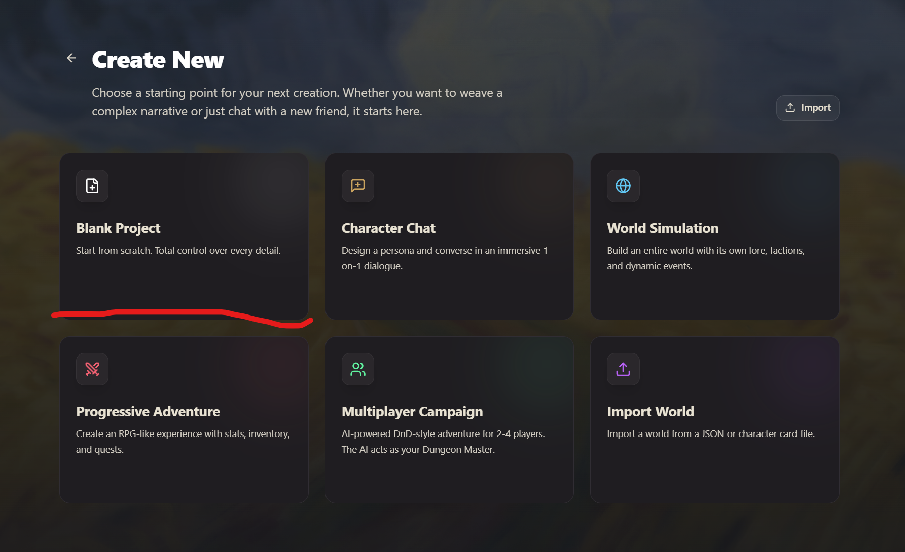
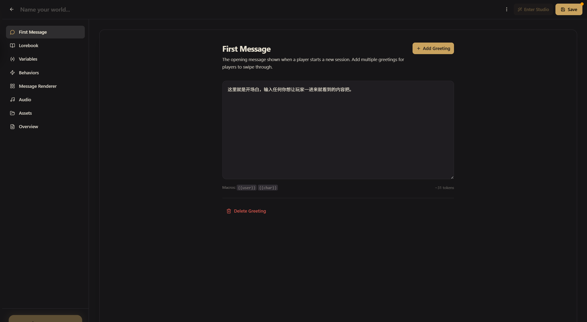
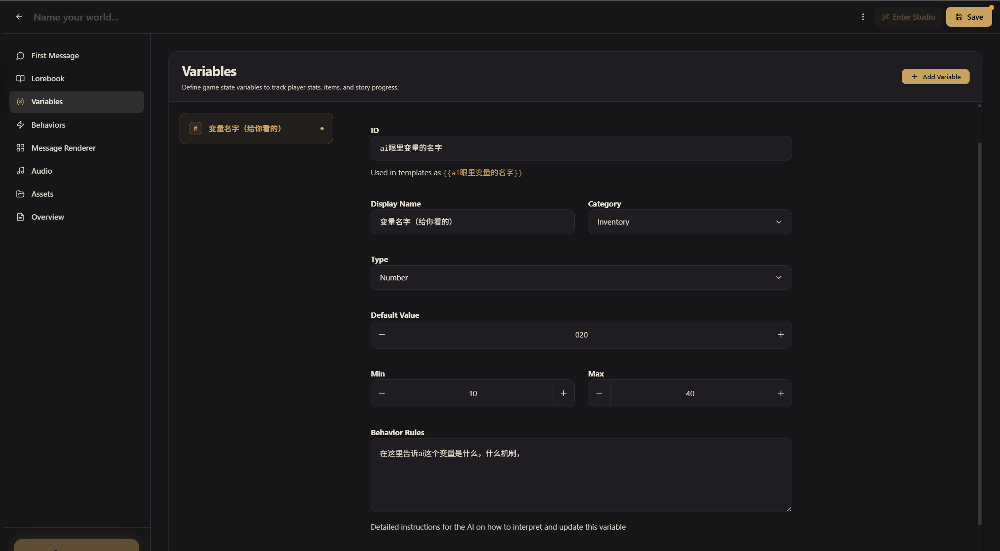
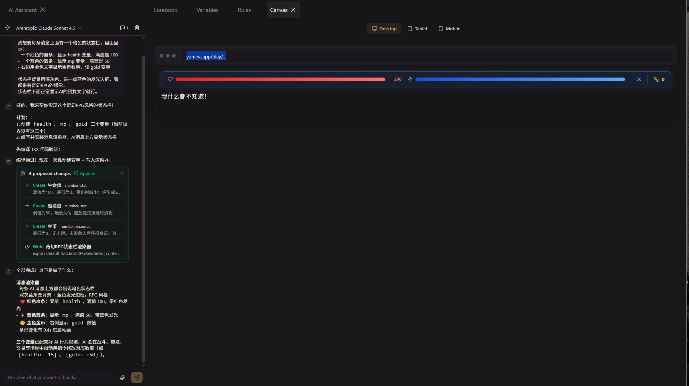

# 新手指南：认识编辑器

> 这篇会带你把编辑器从头到尾逛一遍，搞清楚每个区域是干嘛的。看完之后你就知道"我想做XX效果，该去哪里设置"了。

## 进入编辑器

在 Yumina 左侧导航栏点 **创建（Create）** 按钮，你会看到模板选择页面 **创建新世界（Create New）**。这里有几个起点可以选：

- **空白项目（Blank Project）** — 从零开始，完全自由
- **角色对话（Character Chat）** — 做一个 1 对 1 的角色聊天
- **世界模拟（World Simulation）** — 构建有阵营、事件的完整世界
- **渐进式冒险（Progressive Adventure）** — 带属性、背包、任务的 RPG
- **多人战役（Multiplayer Campaign）** — 2-4 人 DnD 风格跑团
- **导入世界（Import World）** — 从 JSON 文件或角色卡导入

新手建议选 **空白项目（Blank Project）**，选完直接进入编辑器。在编辑器顶部的输入框里给世界起个名字就行。


<!-- 需要截图：Create New 模板选择页面，几个模板卡片并排展示 -->

---

## 两种编辑模式：简单 vs 高级

选完模板（或导入世界）之后，如果这是你第一次创建世界，会弹出一个模式选择对话框：


<!-- 需要截图：Simple / Advanced 两栏选择对话框 -->

| 模式 | 长什么样 | 适合谁 |
|------|---------|--------|
| **简单（Simple）** | 三块引导式字段（AI 角色、场景设定、语气要求）+ 角色列表 + 概览。只有最核心的内容会显示 | 刚接触 Yumina、想把脑子里的想法快速变成能玩的世界 |
| **高级（Advanced）** | 完整 8 个区域：首条消息、知识库、变量、行为、自定义 UI、音频、资源、概览 | 有明确玩法设计、想用变量/规则/自定义 UI 的创作者 |

**两种模式下的数据是共通的**——简单模式填的东西不会丢，只是换个视图看。高级模式里看到的条目、概览字段都是同一份数据，简单模式只是把"变量、行为、自定义 UI、音频"这些高级字段收起来不显示而已。

::: tip 可以随时切换
编辑器右上角有一个 **简单 / 高级** 切换器，点一下就换。切换之后你的选择会被记住，下次新建世界会直接用同样的模式进入。

如果你一开始选了简单模式填了几段内容，发现不够用，**直接切到高级**——刚填的 AI 角色、场景、语气会作为预设条目出现在知识库里，角色变成角色条目，完全衔接。反过来也行，但如果高级模式里你已经用了变量、行为、自定义 UI，切到简单模式它们只是被隐藏，不会被删。
:::

::: info 简单模式更像是什么
你可以把简单模式理解成 **"创作者的入门表单"**——它在后台仍然是用条目（entries）存的，只是 UI 把几个关键字段（`simple:prompt`、`simple:setting`、`simple:tone` 标签的条目）拎出来让你填。搞清楚了这点，你就明白为什么数据能无缝衔接。
:::

下面介绍的是 **高级模式** 完整的 8 个区域。如果你现在在简单模式里，只能看到首条消息、知识库、概览这三块——看完下面的内容，你自然会理解简单模式隐藏了什么、什么时候该切到高级。

---

## 编辑器长什么样

进来之后，你会看到这样的界面：


<!-- 需要截图：编辑器全貌，左侧导航栏完整展示，右侧是某个区域的内容 -->

左边是导航栏，一共 8 个区域。别被数量吓到，我们一个一个来看 (•̀ᴗ•́)و

---

## 首条消息（First Message）

这是玩家进入你的世界后看到的 **第一条消息**。还没等玩家说话，AI 就先开口了——这条就是开场白。

好的开场白应该做到两件事：
1. 让玩家知道自己在什么处境（"你醒来发现自己在一个陌生的房间……"）
2. 给玩家一个行动的理由（"门外传来了敲门声"）

点 **添加问候语** 按钮就能开始写。


<!-- 需要截图：First Message 编辑区域，最好有一段示例开场白内容 -->

::: tip 小贴士
一个世界可以有多条问候语。玩家进入后默认看到第一条，可以左右滑动（swipe）切换其他问候语。适合提供不同的开局场景让玩家选择。
:::

---

## 知识库（Lorebook）

这是编辑器里你会花最多时间的地方。

**条目是你写给 AI 看的所有内容**——角色人设、世界观设定、写作风格要求、示例对话、剧情线索……全都是条目。你可以把它理解成 AI 的"剧本"。


<!-- 需要截图：Lorebook 区域，左侧分组栏（预设/示例/聊天历史/后置），右侧是条目编辑面板 -->

### 四个分组

左侧有四个分组，决定条目在提示词里的位置。创建条目时，在哪个分组下点 **添加条目**，条目就属于哪个分组：

| 分组 | 作用 |
|------|------|
| 预设 | **始终发送**的核心设定（角色、世界观、风格）。AI 每次都能看到 |
| 示例 | 示例对话，教 AI 怎么说话 |
| 聊天历史 | **关键词触发**的条目——只有聊天中出现匹配关键词才会激活 |
| 后置 | 放在所有对话之后的兜底指令，AI 最后看到，印象最深 |

### 发送方式（Send as）

每个条目都有一个 **发送方式** 设置，决定 AI 怎么看待这段内容：

| 选项 | 英文 | 什么意思 |
|------|------|---------|
| 指令 | Instruction | AI 把这当成系统规则来遵守（最常用） |
| 用户 | User | AI 以为这是玩家说的话 |
| AI | AI | AI 以为这是自己之前说过的话。写示例对话或 CoT 绕过时用 |

### 标签（Tags）

用标签给条目分类：Characters（角色）、Plot（剧情）、Style（风格）、Example（示例）、Preset（预设），也可以点 **+ New** 创建自定义标签。标签纯粹是方便你自己管理，不影响条目的行为。

### 关键词触发

条目不是每次都会发给 AI 的（AI 一次能读的内容量是有限的，全塞进去会装不下）。

- **预设** 分组的条目始终发送——核心设定放这里
- **聊天历史** 分组的条目用关键词触发——填一些关键词（Keywords），只有聊天中出现这些词才会激活

比如你在聊天历史分组里写了一条关于"黑市"的设定，关键词填 `黑市`。只有玩家提到"黑市"的时候，这条内容才会被发给 AI。这样既不浪费 AI 的阅读量，又能保证 AI 在需要的时候拿到正确的信息。聪明吧 (≧▽≦)

关键词扫描会往前翻几条消息？引擎默认扫描最近 2 条消息——这是 **条目设置（Entry Settings）** 下的 **扫描深度（Scan Depth）**。如果触发不够灵敏，可以调到 4。

### 位置（Position）

数字越小，AI 越优先看到这条内容。如果你有一条特别重要的设定，给它一个小的数字（比如 0），AI 就会更重视它。


<!-- 需要截图：一个条目的编辑面板，能看到发送方式三选一、Content 文本框、Tags 标签、Position -->

::: info 详细参考
想深入了解条目的所有配置（模糊匹配、二级关键词、递归触发、条件触发等），看 → [知识库与条目](./03-entries-and-lorebook.md)
:::

---

## 变量（Variables）

变量是你世界的"记忆"。任何需要追踪的数据——生命值、金币、好感度、当前位置——都存在变量里。

点 **添加变量（Add Variable）** 按钮新建。每个变量需要填：显示名称（Display Name）、类型（Type）、默认值（Default Value）。


<!-- 需要截图：Variables 区域，能看到几个不同类型的变量（number/string/boolean），最好有一个展开的变量编辑面板 -->

四种类型，各有用途：

| 类型 | 存什么 | 举个栗子 |
|------|-------|---------|
| 数字（Number） | 数字 | HP: 100, 金币: 500 |
| 文字（String） | 文字 | 当前位置: "森林" |
| 开关（Boolean） | 是/否 | 有钥匙: 是 |
| JSON（Object / Array） | 复杂数据 | 背包: 剑、药水、地图 |

变量通过 AI 指令自动更新——教程里会详细讲解具体的工作方式。

每个变量还有一个 **行为规则（Behavior Rules）** 字段——用大白话告诉 AI 什么时候、怎么改这个变量。注意：这是**变量自身的一个字段**，和左侧菜单里那个独立的 **行为（Behaviors）** 区域不是同一个东西（那个是自动化逻辑，不是给 AI 的文字说明）。

::: info 详细参考
操作语法、嵌套路径、JSON变量的高级用法 → [变量系统](./04-variables.md) 和 [AI 指令与宏](./05-directives-and-macros.md)
:::

---

## 行为（Behaviors）

行为是你世界的"自动化管家"。它让你实现这种效果：

- "HP 降到 0 → 弹出通知'你死了'"
- "每 3 回合 → 饥饿度 +1"
- "玩家说了'投降' → 触发特殊结局"
- "60 秒倒计时结束 → 炸弹爆炸"

点 **添加行为（Add Behavior）** 后，每条行为就三个部分：**WHEN**（什么时候触发）→ **ONLY IF**（条件满足吗，可选）→ **DO**（做什么）


<!-- 需要截图：Behaviors 区域，能看到行为列表和一条行为的编辑面板（WHEN、ONLY IF、DO 三块） -->

举个最简单的例子：

```
WHEN:    变量越过阈值（Variable crosses threshold）— health 降到 0 以下
ONLY IF: （不填）
DO:      显示通知（Show notification）— "你死了"，danger 样式
```

不需要写代码，在编辑器里点点选选就能配好。

::: info 详细参考
所有触发器类型、动作类型、优先级和冷却机制 → [行为规则引擎](./06-rules-engine.md)
:::

---

## 自定义 UI（根组件）

默认情况下，AI 的回复就是一段普通文字。但你见过的那些很酷的世界——气泡对话、视觉小说画面、带血条和背包的游戏界面——都是通过 **根组件（Root Component）** 实现的。

每个新世界都自带一个根组件——一棵 TSX 文件树，默认入口 `index.tsx` 里就一行：

```tsx
export default function MyWorld() {
  return <Chat />;
}
```

这就是默认聊天界面，不改它玩家看到的就是普通对话。要做你自己的 UI，常用三种改法：

| 想要 | 怎么改 |
|------|--------|
| 只换消息的样子（气泡、字体、配色） | 给 `<Chat />` 加 `renderBubble` prop |
| 聊天 + 旁边浮一块状态面板 | 在根组件里把 `<Chat />` 和你的面板放进同一个 flex 布局 |
| 完全自定义的全屏 UI（视觉小说、地图） | 不要 `<Chat />`，自己用 `<MessageList />` 和 `<MessageInput />` 拼 |


<!-- 需要截图：编辑器 → 自定义 UI 区块，能看到根组件的多文件 tab + 代码编辑区 -->

"等等，代码？！我不会写代码啊" ——别慌，你不用自己写 (￣▽￣)ノ

### 方法一：用 Yumina 内置的 Studio AI

编辑器里点 **进入工作室**，打开 **AI Assistant** 面板，直接用大白话描述你想要的效果——"每条消息上面加个血条"、"做成视觉小说风格"。Studio 生成代码后会实时预览，满意就点 **批准（Approve）**，不满意继续改。




### 方法二：用外部 AI（Claude、ChatGPT 等）

把你想要的效果告诉外部 AI，但要附上 Yumina 的技术信息让它能写出对的代码。[自定义 UI 指南](./07-components.md) 里有一段现成的技术信息块可以直接复制。生成的代码粘贴到 自定义 UI → 编辑器，能编译就搞定了。

核心积木其实很少：`<Chat />` 一行就是完整聊天界面，`renderBubble` 接管气泡样式，剩下靠 Tailwind 和几个自己写的小组件（血条、对话框、选项按钮）就能堆出任何你想要的画面。Studio AI 和 [自定义 UI 指南](./07-components.md) 里都有现成的骨架可以直接复用。

::: tip Studio 是什么
Studio 是编辑器的"进阶模式"。除了 AI 助手，还有代码编辑器、实时预览、测试面板。点编辑器顶部的 **进入工作室** 就能进去。后面的 [自定义 UI 指南](./07-components.md) 会详细讲。
:::

::: info 详细参考
完整的 UI 定制教学（根组件结构、`<Chat>` API、可用工具、AI prompt 示例、四个常用骨架）→ [自定义 UI 指南](./07-components.md)
:::

---

## 音频（Audio）

给你的世界加上 BGM、音效和环境音。支持三种音频类型：

| 类型 | 用途 | 例子 |
|------|------|------|
| BGM | 背景音乐 | 主题曲、战斗音乐 |
| SFX | 音效 | 开门声、爆炸声 |
| Ambient | 环境音 | 雨声、人群嘈杂 |

最简单的使用方法：先在 **资源（Assets）** 区域上传音频文件，然后在 **音频（Audio）** 区域点 **添加音轨（Add Track）**，选择音频来源，就可以使用了。

你可以设置：
- 简单的循环播放
- 根据游戏状态自动切歌（比如进入战斗换成战斗 BGM）
- 让 AI 在回复中触发音效（`[audio: explosion play]`）

::: info 详细参考
播放列表、条件 BGM、AI 音频指令 → [音频系统](./09-audio.md)
:::

---

## 资源（Assets）

上传图片和音频素材的地方。角色立绘、场景图、道具图标、BGM……传上来之后可以在渲染器或音频里引用。


<!-- 需要截图：Assets 区域，能看到已上传的几张图片缩略图 -->

---

## 概览（Overview）

世界的"个人信息页"。在这里设置：

- **封面图片（Cover Image）** — 玩家在社区列表里第一眼看到的图
- **图库图片（Gallery Images）** — 最多 8 张展示图
- **描述（Description）** — 详细介绍你的世界
- **标签（Tags）** — 帮助别人发现你的世界，最多 7 个
- **公告（Announcement）** — 置顶消息，适合写更新日志
- **预计时长（Approx. Time）** — 告诉玩家大概要玩多久
- **语言（Language）** — 设置你的世界的语言（支持中/英/日/韩等 10 种语言）
- **多人模式（Allow Multiplayer）** — 是否允许多人一起玩

### 多语言版本（Variants）

如果你想让自己的世界既有中文版又有英文版，让全球玩家都能玩，Yumina 提供了 **变体（Variant）** 系统——把同一个世界的不同语言翻译链接成一组。玩家在世界详情页可以一键切换语言，社区列表里这一组只算一个世界，浏览数据合并统计。

**变体是怎么用的**：编辑器顶部有一条 **变体标签栏（Variant Tab Bar）**，第一次只显示当前世界这一个标签，旁边有一个 **+ 新建变体（New Variant）** 按钮。点这个按钮：

1. 弹出语言选择对话框，选 **English**（或其他你想做的语言）
2. Yumina 会**复制当前世界的全部内容**（条目、变量、规则、组件、音频……）作为新变体的起点，并跳转到新变体的编辑界面
3. 你只需要把内容翻译成英文，结构、变量名、规则全保留——这样玩家切换语言后游戏行为完全一致
4. 翻译完保存，回到任意一个变体的编辑器，标签栏里两个变体都会出现，点哪个就切到哪个


<!-- 需要截图：编辑器顶部 Variant Tab Bar，能看到两个变体标签（带语言徽章）+ 新建按钮 -->

**变体标签的小操作**：

- **重命名** — 鼠标悬停在标签上，点铅笔图标，把"Variant 2"改成更清楚的名字（比如"专业术语版"）
- **改语言** — 点标签左边的语言徽章（如 `EN` / `ZH`），可以重新选语言
- **删除** — 鼠标悬停后点 X，第一次点是确认，第二次才真正删除

::: tip 变体不只是"翻译"
变体本质上是关联起来的**独立世界**。所以你也可以用变体做：
- **同一世界的难度版本**（普通版 / 困难版）
- **同人改编版**（保留原作设定，换主角视角）
- **节日特别版**（春节版、万圣节版）

只是发布后玩家会看到"语言切换"的 UI——如果你的变体不是按语言区分的，记得在变体标签里写清楚（比如把语言徽章设成相同的 `ZH`，标签写"普通版"和"困难版"，玩家会理解）。
:::

::: warning 单独修改、不会自动同步
建好两个变体后，**它们之间不会自动同步**。在中文版加一个新条目，英文版不会自动加。如果你的世界还在频繁迭代，建议先把内容定下来再做翻译变体；或者在主语言版加完新内容后，手动复制粘贴到其他变体里。

未来 Yumina 计划支持"翻译同步"和 AI 协助翻译，但目前还需要手动处理。
:::

做完世界、测试没问题之后，回到 **发现（Discover）** 页面，点顶部的 **发布（Publish）** 按钮就能把世界上线。

::: info 详细参考
发布流程、Bundle 导出、多人模式、多语言支持 → [发布、导出与 Bundle](./11-publish-and-share.md)
:::

---

## 测试你的世界

编辑器左侧导航栏最底部有一个大大的 **开始游戏** 按钮——点它就能开始测试。会弹出会话选择界面，点 **新建会话（New Session）** 就能进入你的世界开始玩了。

测试中觉得哪里不对？随时回编辑器改，改完点 **保存（Save）**，再 PLAY 一次。

---

## 引擎在背后做了什么

好奇玩家发一条消息后，背后到底发生了什么？完整的流水线（条目→提示词→AI→指令→变量→行为→渲染）在 [核心概念速览](./01-core-concepts.md#运行流程) 里有详细图解，这里不重复了。

一句话版本：引擎把条目组装成提示词发给 AI → AI 回复带指令 → 引擎提取指令更新变量 → 触发行为 → 渲染给玩家。每次发消息都跑一遍，玩家完全无感 ∠( ᐛ 」∠)＿

---

## 下一步

编辑器的每个区域你都认识了。接下来跟着 [手把手教程](./02-tutorial-basic.md) 动手做一个出来——所有这些功能怎么配合使用，做一遍就全明白了。做一遍比看十遍文档有用 ᕕ( ᐛ )ᕗ
