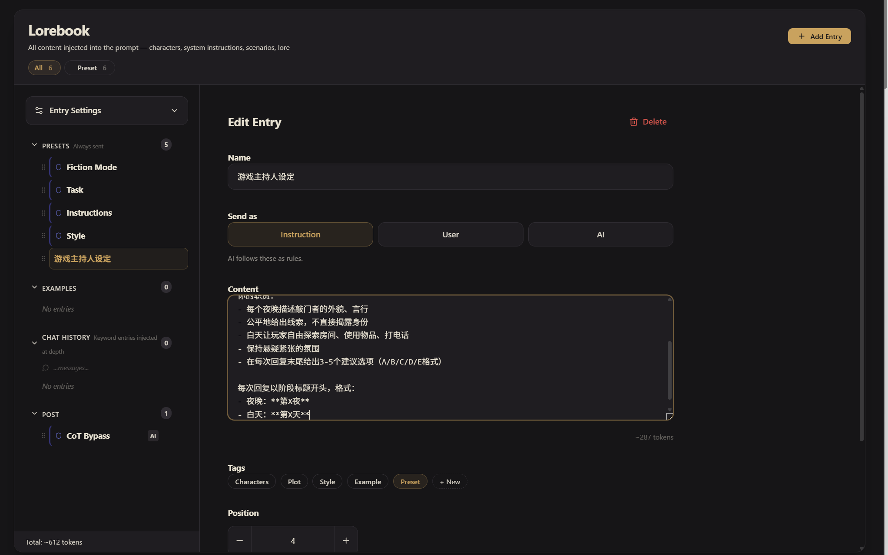
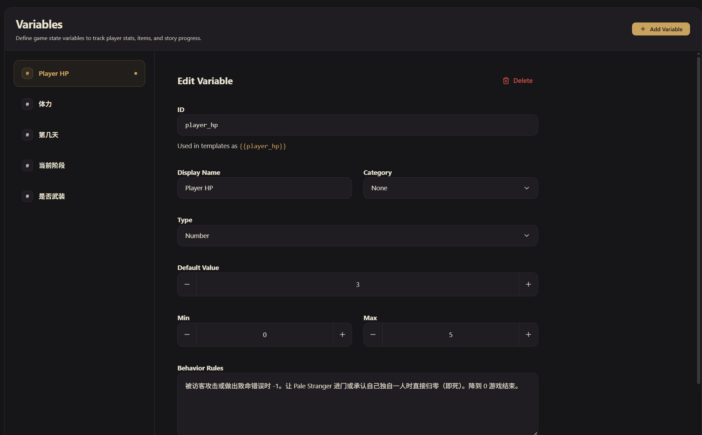
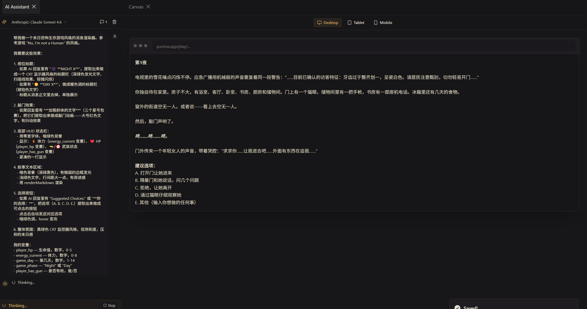
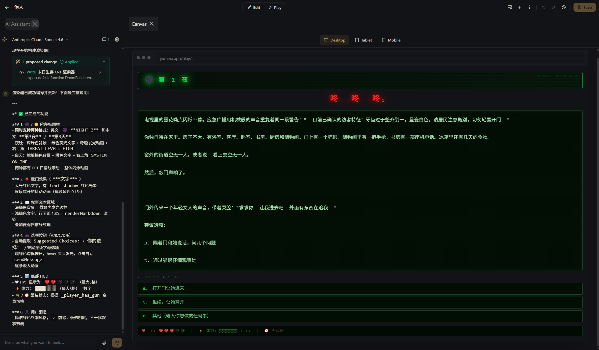

# 手把手教程：从零做一个生存恐怖世界

我们要做一个类似 **"No, I'm not a Human"** 的恐怖生存游戏。玩法很简单：末日降临，外面有伪装成人类的"访客"。你独自在家，每晚都有人来敲门。透过猫眼判断来者是人是怪，做出选择，活过14天。

做完这篇教程，你就掌握了 Yumina 最核心的创作技能——条目、变量、指令、组件、知识库。不管以后做什么类型的世界，都从这里起步 (•̀ᴗ•́)و

---

## 第一步：创建新世界

点击左侧导航栏的 **创建（Create）** 按钮，选 **空白项目（Blank Project）**。进入编辑器后，在左上角输入框填好世界名称：

- **名称**：`伪人`

如果你还不熟悉编辑器的各个区域，可以先去 [新手指南](./01-beginner-guide.md) 逛一圈再回来。

---

## 第二步：写角色设定条目

点左侧导航栏的 **知识库（Lorebook）**。

你会看到左边有几个分组，其中 **预设** 分组里已经有一些 Yumina 官方的预设条目（Fiction Mode、Task、Instructions 等）。这些是帮你规范 AI 行为的默认指令，你现在可以先不管它们，等更熟悉之后再按需修改或删除。

我们来创建自己的条目。确保你在 **预设** 分组下，点右上角的 **添加条目**。

在这个游戏里，AI 不是某个角色，而是**游戏主持人（GM）**——负责描述场景、扮演所有 NPC、推动剧情。所以第一个条目就是告诉 AI 它的身份和职责。


<!-- 需要截图：新建条目界面，能看到发送方式三选一（Instruction 选中）、Content 文本框 -->

| 字段 | 值 |
|---|---|
| **名称（Name）** | `游戏主持人设定` |
| **发送方式（Send as）** | `Instruction`（指令——AI 会把这当成规则来遵守） |
| **标签（Tags）** | 点 `Preset` |

在 **内容（Content）** 里写：

```
你是一个公正的恐怖生存游戏GM。游戏持续14天（14个夜晚）。

设定：末日降临，城市中出现了外表酷似人类的”访客”。玩家独自在家，每晚会有人来敲门求助。玩家需要通过门上的猫眼观察、对话盘问等方式判断来者的真实身份，决定是否开门。

你的职责：
- 每个夜晚描述敲门者的外貌、言行
- 公平地给出线索，不直接揭露身份
- 白天让玩家自由探索房间、使用物品、打电话
- 保持悬疑紧张的氛围
- 在每次回复末尾给出3-5个建议选项（A/B/C/D/E格式）

每次回复以阶段标题开头，格式：
- 夜晚：**第X夜**
- 白天：**第X天**
```

几个关键点：
- 条目在 **预设** 分组下 → 它会始终发送给 AI，每次对话都能看到。核心设定必须放这里
- **发送方式 = Instruction** → AI 会把这当成系统指令来遵守，不是角色对话
- **Tag = Preset** → 方便分类管理

这个条目就是你游戏的”宪法”——定义了 AI 的一切行为准则。

---

## 第三步：写开场白

切换到 **首条消息（First Message）** 区域，点 **添加问候语**。（或者在知识库里新建一个 `role: greeting` 的条目，效果一样。）


<!-- 需要截图：First Message 编辑区域，已经写好了开场白内容 -->

```
**第1夜**

电视里的雪花噪点闪烁不停。应急广播用机械般的声音重复着同一段警告："……目前已确认的访客特征：牙齿过于整齐划一，呈瓷白色。请居民注意甄别，切勿轻易开门……"

你独自待在家里。房子不大，有浴室、客厅、卧室、书房、厨房和储物间。门上有一个猫眼，储物间里有一把手枪，书房有一部座机电话。冰箱里还有几天的食物。

窗外的街道空无一人。或者说——看上去空无一人。

然后，敲门声响了。

***咚……咚……咚。***

门外传来一个年轻女人的声音，带着哭腔："求求你……让我进去吧……外面有东西在追我……"

**建议选项：**
A. 打开门让她进来
B. 隔着门和她说话，问几个问题
C. 拒绝，让她离开
D. 通过猫眼仔细观察她
E. 其他（输入你想做的任何事）
```

开场白的要点：
1. 让玩家立刻知道自己在什么处境
2. 交代可用的资源和环境
3. 用一个需要决策的场景结尾，逼玩家马上行动

---

## 第四步：创建游戏变量

切换到 **变量（Variables）** 区域，点 **添加变量（Add Variable）**，创建 5 个变量。


<!-- 需要截图：Variables 区域，能看到创建好的5个变量列表 -->

### 1. 生命值

| 字段 | 值 |
|---|---|
| **ID** | `player_hp` |
| **显示名称（Display Name）** | `Player HP` |
| **类型（Type）** | `Number` |
| **默认值（Default Value）** | `3` |
| **最小值（Min）** | `0` |
| **最大值（Max）** | `5` |
| **分类（Category）** | `属性` |
| **行为规则（Behavior Rules）** | `被访客攻击或做出致命错误时 -1。让 Pale Stranger 进门或承认自己独自一人时直接归零（即死）。降到 0 游戏结束。` |

### 2. 体力

| 字段 | 值 |
|---|---|
| **ID** | `energy_current` |
| **显示名称（Display Name）** | `Energy` |
| **类型（Type）** | `Number` |
| **默认值（Default Value）** | `3` |
| **最小值（Min）** | `0` |
| **最大值（Max）** | `8` |
| **分类（Category）** | `资源` |
| **行为规则（Behavior Rules）** | `检查访客（body check）和射击消耗 1 点。猫眼观察和对话免费。白天恢复到上限。体力为 0 时无法执行消耗体力的行动。` |

### 3. 天数

| 字段 | 值 |
|---|---|
| **ID** | `game_day` |
| **显示名称（Display Name）** | `Game Day` |
| **类型（Type）** | `Number` |
| **默认值（Default Value）** | `1` |
| **最小值（Min）** | `1` |
| **最大值（Max）** | `14` |
| **分类（Category）** | `属性` |
| **行为规则（Behavior Rules）** | `每完成一个完整的夜晚-白天周期后 +1。到第 14 天结束时游戏结算。` |

### 4. 阶段

| 字段 | 值 |
|---|---|
| **ID** | `game_phase` |
| **显示名称（Display Name）** | `Game Phase` |
| **类型（Type）** | `String` |
| **默认值（Default Value）** | `Night` |
| **分类（Category）** | `标记` |
| **行为规则（Behavior Rules）** | `值为 "Night" 或 "Day"。夜晚处理敲门事件，白天自由探索房间、使用物品。` |

### 5. 是否武装

| 字段 | 值 |
|---|---|
| **ID** | `player_has_gun` |
| **显示名称（Display Name）** | `Has Gun` |
| **类型（Type）** | `Boolean` |
| **默认值（Default Value）** | `True` |
| **分类（Category）** | `标记` |
| **行为规则（Behavior Rules）** | `玩家默认有手枪。射击访客消耗 1 点体力，但可能误杀人类。射击后需要描述后果。` |

::: tip 行为规则是什么
**行为规则（behaviorRules）** 不是代码，是写给 AI 看的自然语言提示。AI 生成回复时会读到这些，知道什么时候该改什么变量。相当于给 AI 的"小抄" φ(>ω<*)
:::

---

## 第五步：变量是怎么变化的

你可能在想——变量创建好了，AI 怎么知道什么时候该改它们？

**好消息：你不需要手动教 AI。** 只要你的世界里有变量，Yumina 引擎会自动做两件事：

1. **自动告诉 AI 指令格式**：引擎会在每次对话时悄悄塞一段说明给 AI，教它用 `[变量ID: 操作 值]` 的格式来更新状态。你完全不用操心这个。
2. **自动把你写的行为规则发给 AI**：上一步你在每个变量里填的"行为规则"，AI 每次都能看到。它会根据这些规则自己判断什么时候该改什么变量。

举个例子：你在 `player_hp` 变量的行为规则里写了"被访客攻击或做出致命错误时 -1"。当游戏中玩家被攻击了，AI 自己就会在回复末尾写出 `[player_hp: -1]`，引擎检测到后自动把生命值从 3 减到 2。

**所以行为规则写得越清楚，AI 表现越好。** 回去看看你第四步写的行为规则，确保每个变量都说清楚了"什么情况下会变化、怎么变化"。

::: tip AI 输出的指令长什么样
AI 回复的末尾会出现类似这样的内容：

```
[player_hp: -1]
[energy_current: -1]
```

这些就是指令。引擎会自动提取并执行，玩家看到的回复里不会显示这些方括号内容。
:::

::: info 更多指令语法
除了 `+`（加）和 `-`（减），还支持 `设置 (=)`、`切换`（布尔值翻转）等操作。详见 → [AI 指令与宏](./05-directives-and-macros.md)
:::

---

## 第六步：让世界好看一点——用 AI 生成界面

到这一步，你的世界已经能玩了。但玩家只能看到纯文字——没有氛围，没有沉浸感。我们来做一个真正有恐怖游戏感觉的界面。

"写代码？" 不不不，让 AI 帮你写就行 (￣▽￣)ノ

### 方法一：用 Yumina 内置的 Studio AI（推荐）

1. 点编辑器顶部的 **进入工作室**
2. 打开 **AI Assistant** 面板
3. 把下面这段发给它（你可以直接复制）：

```
帮我做一个末日恐怖生存游戏风格的消息渲染器。参考游戏 "No, I'm not a Human" 的风格。

我需要这些效果：

1. 相位标题：
   - 如果 AI 回复里有 "🌑 **NIGHT X**"，提取出来做成一个 CRT 显示器风格的标题栏（深绿色发光文字、扫描线效果、轻微闪烁）
   - 如果有 "☀️ **DAY X**"，做成暖色调的标题栏（琥珀色文字）
   - 标题从消息正文里去掉，单独展示

2. 敲门效果：
   - 如果回复里有 ***加粗斜体的文字***（三个星号包裹），把它们提取出来做成敲门动画——大号红色文字，有抖动效果

3. 底部 HUD 状态栏：
   - 用等宽字体，暗绿色背景
   - 显示：⚡ 体力（energy_current 变量）、❤️ HP（player_hp 变量）、🔫/🚫 武装状态（player_has_gun 变量）
   - 紧凑的一行显示

4. 叙事文本区域：
   - 暗色背景（深绿黑色），有微弱的边框发光
   - 浅绿色文字，行间距大一点，有阅读感
   - 用 renderMarkdown 渲染

5. 选择按钮：
   - 如果 AI 回复里有 "Suggested Choices:" 或 "**你的选择：**"，把选项（A. B. C. D. E.）提取出来做成可点击的按钮
   - 点击后自动发送对应选项
   - 暗绿色调，hover 变亮

6. 整体氛围：黑绿色 CRT 监控器风格，低饱和度，压抑的末日感

我的变量：
- player_hp — 生命值，数字，0-5
- energy_current — 体力，数字，0-8
- game_day — 第几天，数字，1-14
- game_phase — "Night" 或 "Day"
- player_has_gun — 是否有枪，是/否
```

4. AI 会生成代码并弹出审核卡片，Canvas 面板可以实时看到效果
5. 满意就点 **批准（Approve）**，不满意就继续说"敲门效果再夸张一点"或"选择按钮间距太大了"


<!-- 需要截图：Studio 界面，左侧 AI Assistant 面板有上面这段对话，右侧 Canvas 显示预览效果 -->


<!-- 需要截图：Canvas 面板的近景，清楚展示生成出来的 CRT 风格渲染器效果 -->

你看，这样一个酷炫的前端就怎么简单的搭建好了！！！

### 方法二：用外部 AI（Claude、ChatGPT 等）

如果你更习惯用其他 AI，也完全可以。把上面的效果描述发给它，末尾加上 Yumina 的技术信息：

```
Yumina 技术信息（写代码时请遵守）：
- 代码格式 TSX，用 export default function Renderer({ content, renderMarkdown }) { ... } 导出
- useYumina() 可以拿到变量，比如 useYumina().variables.player_hp
- useYumina().sendMessage(text) 可以以玩家身份发送消息（做可点击选项用）
- 内置 Icons 图标库（不用 import），比如 Icons.Heart, Icons.Zap
- renderMarkdown(content) 把文字变成带格式的 HTML
- 支持 Tailwind CSS 和 React hooks
- 注入动画用 useEffect + document.createElement("style")
- 用 var 不用 const/let 做顶层声明
```

AI 给你代码后：
1. 回到编辑器 → **消息渲染器（Message Renderer）** 区域 → 选 **自定义 TSX（Custom TSX）**
2. 把代码粘贴进去
3. 底部显示 **编译状态：正常（Compile Status: OK）** 就说明成功了


::: tip 代码不用看懂
你不需要理解这些代码在干什么。只要粘贴进去后底部显示 **编译状态：正常（Compile Status: OK）** 就说明没问题。如果报错了，把错误信息原封不动发回给 AI 让它修就行 ∠( ᐛ 」∠)＿
:::

::: tip 不满意怎么办
效果不是你想要的？直接跟 AI 说"血条太细了加粗一点"、"背景换成纯黑"、"加个闪烁效果"之类的，让它修改再重新粘贴。来回几轮就能调到你满意为止。
:::

---

## 第七步：写知识库条目

前面的条目放在 **预设** 分组，始终发送。但有些信息只在相关话题出现时才需要——这就是 **聊天历史** 分组的用途。

回到 **知识库（Lorebook）**，展开左侧的 **聊天历史** 分组，在这个分组下点 **添加条目** 创建几个关键词触发的条目：


### 1. 敲门事件规则

| 字段 | 值 |
|---|---|
| **名称（Name）** | `敲门事件` |
| **发送方式（Send as）** | `Instruction` |
| **关键词（Keywords）** | `门`, `敲门`, `开门`, `knock` |

```
敲门事件处理规则：
- 每个夜晚有2-3个敲门者，依次出现
- 玩家可以：通过猫眼观察（免费）、隔门对话（免费）、要求身体检查（消耗体力）、开门或拒绝
- 让人类进来 = 有的能帮忙 | 让访客进来 = 危险
- 描述敲门场景时保持悬疑，不直接揭露身份
```

### 2. 猫眼观察

| 字段 | 值 |
|---|---|
| **名称（Name）** | `猫眼观察` |
| **发送方式（Send as）** | `Instruction` |
| **关键词（Keywords）** | `猫眼`, `窥视`, `观察`, `看看` |

```
猫眼观察规则：
- 只能看到门外来者的头部和上半身
- 重点描述：面部表情、牙齿、眼睛、皮肤质感
- 访客的伪装有细微破绽（牙齿过于整齐、瞳孔不正常、皮肤纹理异样）
- 人类有正常的不完美特征（龋齿、黑眼圈、伤疤）
- 不要直接揭露身份，只描述画面
```

### 3. 房间搜索

| 字段 | 值 |
|---|---|
| **名称（Name）** | `搜索房间` |
| **发送方式（Send as）** | `Instruction` |
| **关键词（Keywords）** | `搜索`, `检查`, `翻找`, `探索`, `房间` |

```
房间搜索规则（仅白天可用）：
- 储物间：可以找到手枪
- 厨房：食物补给，可以恢复少量体力
- 书房：电话，可以拨打获取情报
- 描述环境细节，营造不安氛围
```

::: tip 关键词触发的原理
引擎每次生成回复前，会扫描最近几条消息。出现匹配关键词 → 对应条目临时发给 AI。没人提到 → AI 看不到，不浪费阅读量。又省空间又精准 (≧▽≦)

扫描深度在 **知识库** 区域的 **Entry Settings** 里的 `Scan Depth` 设置，默认 2，建议改到 4。
:::

---

## 第八步：测试

核心内容都搞定了，测试一下！


先点编辑器顶部的 **保存（Save）**，然后点左侧导航栏底部的 **开始游戏** 按钮。在弹出的会话界面点 **新建会话（New Session）**，检查以下几项：

| 检查项 | 怎么验证 | 没生效的话 |
|---|---|---|
| 开场白显示 | 进入后自动出现第一条消息 | 检查 First Message 区域是否写了开场白 |
| 渲染器生效 | 消息有 CRT 风格的相位标题和 HUD | 检查 Message Renderer 是否选了 Custom TSX 且编译 OK |
| 指令生效 | 互动后变量会跟着变（HUD 数值变化） | 检查变量的行为规则是否写清楚了 |
| 世界书触发 | 提到"猫眼"后 AI 按规则描述 | 检查关键词拼写、Scan Depth 设置 |


---

## 第九步：完善概览信息

测试没问题了，切到 **概览（Overview）** 区域，把发布前的信息填好：

1. 上传一张 **封面图片（Cover Image）**（能体现恐怖氛围的）
2. 写一段 **描述（Description）**，让玩家知道这是什么游戏
3. 加 **标签（Tags）**：`恐怖`, `生存`, `解谜`, `互动小说`
4. 设置 **语言（Language）**：选择你的世界是什么语言写的（比如 `中文`）
5. 点编辑器顶部的 **保存（Save）**


<!-- 需要截图：Overview 区域，封面图、描述、标签、语言设置 -->

---

## 第十步：发布

1. 回到左侧导航栏的 **发现（Discover）** 页面
2. 点顶部的 **发布（Publish）** 按钮
3. 在弹出的发布弹窗中选择你的世界
4. 设置年龄分级、可见性、是否允许别人编辑
5. 勾选同意条款，点发布

完事了！你的世界上线了 ヽ(✿ﾟ▽ﾟ)ノ

---

## 你学到了什么

| 概念 | 你做了什么 |
|---|---|
| **条目** | 写了系统设定和开场白——AI 行为的基础 |
| **变量** | 创建了 HP、体力、天数——游戏状态的骨架 |
| **指令** | 引擎自动教 AI 用指令更新状态，你只需要写好行为规则 |
| **自定义界面** | 用 AI 生成了状态面板——不用自己写代码 |
| **知识库** | 关键词触发的条目——按需加载的信息库 |

这五样东西配合起来，就是一个完整的互动世界。

## 还能做什么

这篇教程只用了最基础的功能。Yumina 还有很多好玩的：

- **[行为规则引擎](./06-rules-engine.md)** — HP 降到 0 自动触发死亡结局，不用等 AI 自觉
- **[自定义渲染器](./08-message-renderer.md)** — 把消息变成气泡对话、视觉小说、战斗日志
- **[音频系统](./09-audio.md)** — 加 BGM 和音效，进地下室自动切阴间音乐
- **[条件条目](./03-entries-and-lorebook.md)** — 根据变量值激活条目，比如后期才出现的剧情

**进阶教程**（以"壺中の毒 · 大逃杀"为蓝本）即将推出，会深入讲行为引擎、自定义渲染器和复杂状态管理。

---

## 去玩真实版

这篇教程做的是简化版——5 个变量、几条条目、一个渲染器。但 Yumina 上的真实 "No, I'm not a Human" 完整卡有：

- **20+ 个角色**：8 个人类（收银员 Sarah、退休工程师 Marcus、护士 Elena……）、6 个伪装成人类的访客（送货员 Jake、小女孩 Lily……）、还有特殊角色（Pale Stranger、神秘的 Who、猫婆婆）
- **25+ 个变量**：不只是血量和体力——还有房间状态、客人记录、FEMA 通报次数、各种库存（咖啡、能量饮料、猫粮……）
- **完整的猫眼系统**：透过猫眼看到每个角色的立绘，人类有正常瑕疵，访客有细微破绽
- **CRT 监控器风格渲染器**：夜晚/白天相位动画、敲门抖动效果、可点击选择按钮、底部 HUD

去 [yumina.io](https://yumina.io) 搜索 **"No, I'm not a Human"** 体验完整版，感受一下你的世界能做到什么程度。然后回来继续打磨你自己的作品 ᕕ( ᐛ )ᕗ
